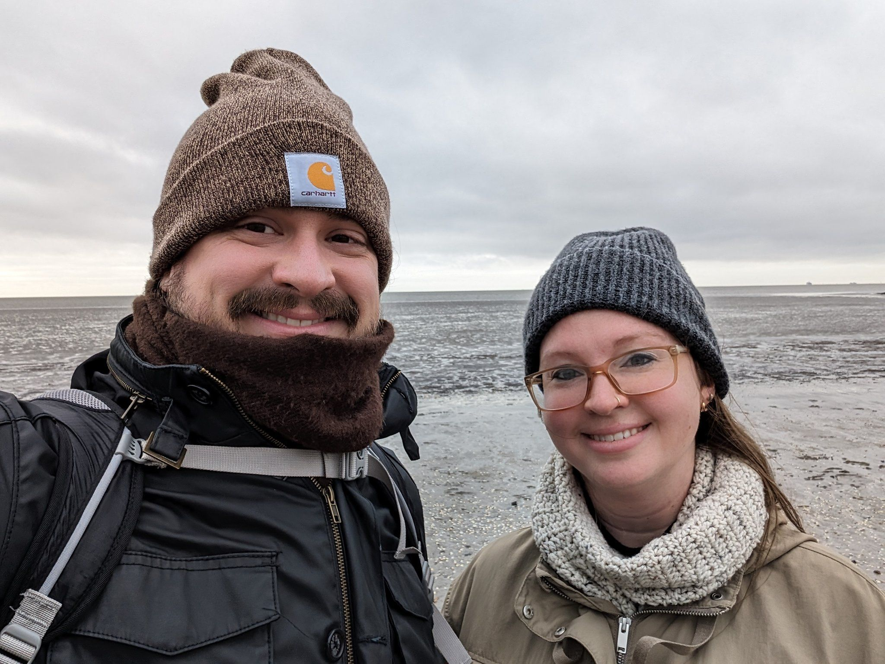
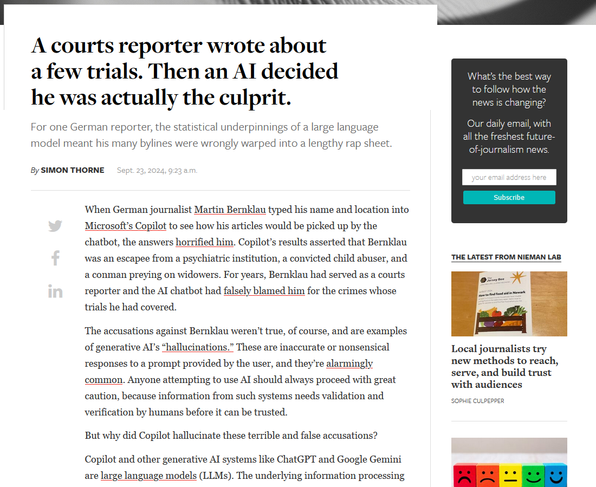
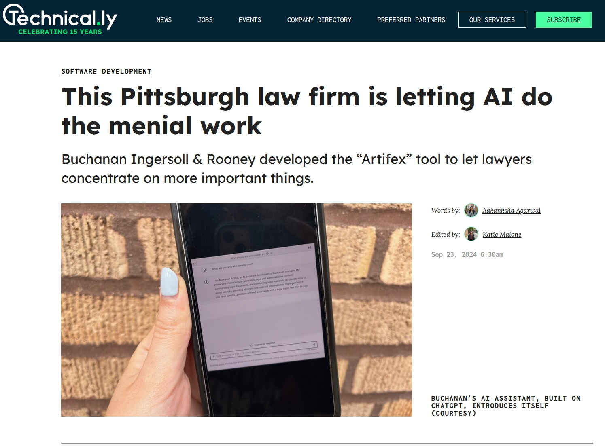
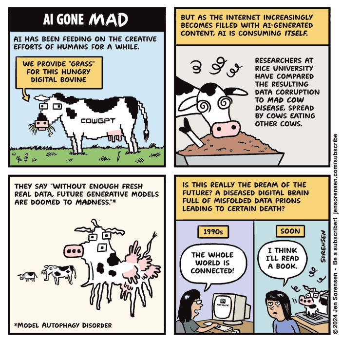
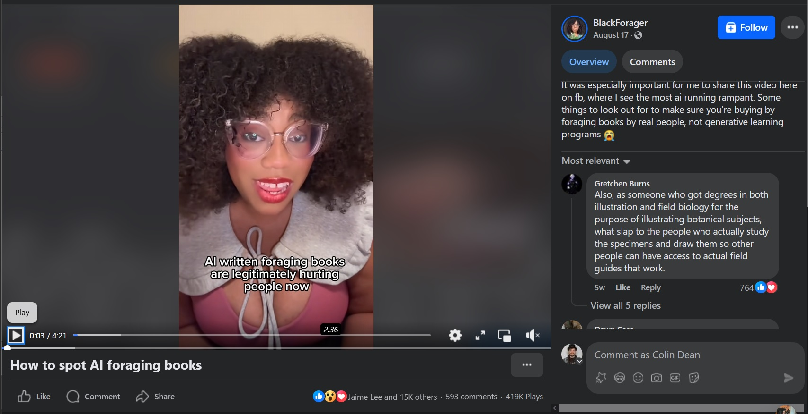

# Who is this guy?

{width=40%}

::: notes

I'm Colin Dean.
I'm a 2007 graduate of mother fair.
I was a Computer Science major with a minor in Creative Writing.
Which was mostly journalism.

:::

---

dubc

::: notes

I did a lot of stuff during my four years at Westminster.

:::

---

{width=70%}

::: notes

I was in the marching and symphonic bands.

This picture was taken by Willis Bretz before he was a famous portait photographer.

:::

---

{width=70%}

::: notes

I joined The Holcad as a layout editor and then became its editor-in-chief for two years.
What you see here is a cut-up of the old masthead and a capture of my last opinion page piece,
plus one of my favorite pictures of Old Main.
And the old logo, all from I talk I give on code review and software architecture.

:::

---

{width=40%}

::: notes

I joined Phi Tau the spring semester of my senior year
after running a newspaper article in which I responded to the question,
"Why didn't you go Greek?" saying, "No one ever asked."
Some Phi Tau friends came to my apartment on a Sunday night.
They interrupted a very important event.
It was a pivotal episode of Battlestar Galactica and I just couldn't miss it so I told them I'd tell them the next day and shut the door.
It was a good decision to join, as most of my closet friends from college, the guys, girls, and non-binary pals I look forward to seeing the most, I met because of joining Phi Tau.

:::

---

{width=40%}

::: notes

That includes Brigette, my partner now of 16 years.
She was a Phi Mu who started the year after I graduated.
I was going to grad school at Robert Morris but spending my weekends at Phi Tau at Westminster,
after living at the house for a summer after graduation then moving back in with my parents in Volant while I was in grad school.

:::

---

{width=40%}

::: notes

We love languages and travel.
This picture is us traipsing about in the beach face of the North Sea at Harlingen Port in The Netherlands.
We have lots of dogs.
This year, we renovated a house together along with my parents, her dad, and some of my friends.
You know, adulting.

:::

---

# Work & Play

::: notes

These days, I work for a national retail company as a software engineer in its Data Science group.
I've previously worked for a small healthcare analytics company as well as IBM Watson.

:::

---

{width=30%}

::: notes

If you've got a Mac and you're doing development on it,
you probably have my name on your machine.
I'm a longtime contributor to Homebrew, a package manager for macOS.

:::

---

::: notes

I run a community of software professionals called Code & Supply.
We're mostly in Pittsburgh.
We focus on hosting Meetups these days but we also have run tech conferences,
some of the biggest Pittsburgh has seen.

:::

---

::: notes

I started a non-profit Internet Service Provider.
We were about to go bankrupt when the pandemic started, having not really grown past a handful of customers.
A connection through a close friend at Westminster — someone who was in the initial group of people that made this here Professional Networking Symposium happen — had a connection to a wealthy philanthropist whose summer program now wasn't going to happen but needed something to do with the cash.
We accepted their offer and built it up over the years to around 250 customers.

I stepped away from the organization in 2023 and I understand it's having some financial troubles,
but it's been a foundational experience for me.

:::

---

# Context

::: notes

Context is important.
I'm a human.
I'm full of biases, regardless of how well I try to account for them.
All of this has been to help build context for what follows.
Because that's what AI is: context.

:::

---

GENOEG

<small><em>(that's "enough" in Dutch - sounds like "hen oof")</em></small>

::: notes

Enough about what my time at Westminster brought to my life.
Let's talk more about tech and AI.

:::

---

> The views expressed herein are my own and
> do not necessarily represent the views of
> my employers or associated organization,
> past, present, or future.
>
> They range from personal experience to speculation
> and should not be used for healthcare, financial,
> or legal activities.

::: notes

Before I go much further, I gotta be serious for a moment.
Lawyers say it's a good idea to display and say this.

(read slide)

:::

---

# warning: high level

::: notes

Another warning.
Much of what I say here is very high level, adjusted for the audience.
I might gloss over some things.

:::

---

# warning: heavy

::: notes

Some of this might make you a uncomfortable.
That's OK.
That means you're learning.

> comfort the afflicted and afflict the comfortable

is one of my favorite quotes, from fictional Irish bartender Mr. Dooley written by Finley Peter Dunne.

:::

# other titles

> 1. Meaningful AI: Mass Enablement for Better Humanity
> 1. AI Is Built On Human Behavior: the Good and the Bad
> 1. Generate Time Savers, Not Life Wreckers
> 1. Use AI to Cure Cancer, not to Make People Click Ads

::: notes

To set expectations a bit, these are some other titles I had for this talk.

:::

---

# artificial intelligence

::: notes

* Broad, old field
* Periods of high and low activity
* Much we do now was written long ago, but we didn't have the processing power to analyze the data.

:::

---

## large language models

::: notes

Most of this talk is about large language models.

:::

---

## LLMs

::: notes

LLMs, we call them.
They're good at things like text generation and simple analysis.

:::

---

{width=90%}

::: notes

You have probably at least played with them.

:::

---

# intelligence

::: notes

The intelligence isn't _thought_.

:::

---

::: notes

Don't put Descartes before the horse.

DRINK WATER

:::

---

# humans

::: notes

Large language models work by analyzing massive amounts of data, transforming those words into a series of numbers called embeddings.

Humans authored this data.
The scale of the data? All of Humanity.
Well, all those who write mostly in a particular language.
Around a billion and a half people know English natively or as a second language.
It's just over a billion for Chinese and just over 600 million for Hindi.
Spanish around 560 million and French at 310 million.

:::

---

# math

::: notes

These numbers are then linked together, creating a probabilty of what the next word, or token, will be.

:::

---

## markov chain

::: notes

If you analyze a large body of text, generate this probability, then use a random number generator to choose words based on that probability, you have a Markov Chain text generator.

:::

---

## chat

::: notes

* all the rage
* POLL: how many used it?

:::

---

::: notes

smarterchild was around in the mid 2000s,
a fun late night boredom thing.

It used an early form of natural language processing combined with linear regression, pre-programmed common phrases, and
pattern matching, heuristics, identified keywords and phrases in user inputs to trigger predefined responses and actions.

:::

---

# artificial

---

## stochastic parrot

::: notes

> The term **stochastic parrot** is a metaphor to describe the theory that large language models, though able to generate plausible language, do not understand the meaning of the language they process.

This term was coined in _On the Dangers of Stochastic Parrots: Can Language Models Be Too Big?_ by Emily M. Bender, Timnit Gebru, Angelina McMillan-Major, and Margaret Mitchell.

:::

---

## hallucination

::: notes

From the Stochastic Parrots paper also came the concept of a Hallucination.

> LLMs will occasionally synthesize information that matches some pattern, but not reality.

LLMs can make things up that never existed.

* books and authors
* court cases

:::

---

::: notes

Nieman Lab reported this story, fresh as I was making these slides.

FUN FACT: these kinds of stories are happening so frequently that I didn't really have to look for them.

:::

---

## _art_•ificial

::: notes

This technology can also create art.

:::

---

### deepfakes

::: notes

Deepfakes are art meant to deceive.

You're a few weeks out from the first election in which this technology is widely available and commodity.

California just made it illegal to create and spread political deepfakes within several weeks of an election.

:::

---

### revenge porn deepfakes

::: notes

Case law is building around these but they're still not criminal in many jurisdictions.

:::

---

# trust

::: notes

No one trusted smarterchild with enterprise data or attempted to get it to do their homework.

Microsoft acquired it in 2007 but eventually shelved the technology. Maybe they've unshelved some of it?

Millennials will assuredly remember being advised by high school and college teachers never to trust Wikipedia,
and always search for other sources.
That is, it was OK to start there but never rely solely on it.

_Never rely solely on an LLM._
Always check else, and don't expect the LLM to give you its sources.
_Retrieval Augmented Generation_ is a developing field that combines traditional search with generative AI.

:::

---

## reality

::: notes

We're in an age of growing demagoguery,
where questioning reality without examining it scientifically,
without trusting the experts who express caution,
yields bad decisions on the part of the population because they cannot decide for themselves what is real.

When an autocrat controls the narrative,
and creates a fearful administration based on repeating a lie until it's true because no one can prove the lie fast enough,
well, we're in for a rough time.

Take a class in Russian history.
Or take some masters classes in American history in a few years, maybe at Westminster, or maybe somewhere outside of the US.

:::

---

# good

::: notes

OK that got deep and scary for a moment.

It's not the last of it, but let's talk about some good stuff.

:::

---

::: notes

* Using LLMs to write insurance denial appeals.
* Holden Karau, Netflix & Spark

:::

---

::: notes

Buchanan Ingersoll & Rooney built Artifex, and internal tool for "chatting with legal documents".

:::

---

## Retrieval Augmented Generation

::: notes

RAG is a developing field that combines traditional search with generative AI.

Grounds the AI inside statements from a specific data set and ties statements to source material.

:::

---

## others

* Global Emancipation Network's _Artemis_ human trafficking analysis
* OceanMind illegal fishing detection
* Various cancer detection from computer vision systems

---

# jobs

::: notes

There are some professions that might go away because of it.

:::

---

## acceleration

::: notes

I see a lot of utility in using assistants like ChatGPT for writing things that are boilerplate. For using them as sounding boards _to remind_, but not necessarily _to teach_.

Some people work jobs where this technology can accelerate them so fast they they're out of a job.

Many of these are

:::

---

::: notes

but they are jobs nonetheless and the people doing those jobs will adapt or the job will go away.

Consumers' judgement of the quality of the work done solely by AI is an open question. Only time will tell if the product is good, if the union will tolerate the reduction in force, and if the sincerety of the human holds when using AI.

:::

---

## spreadsheets

::: notes

Spreadsheets didn't obsolete accountants.
They made them faster.
Those who didn't want to use the technology faded away.
Now, it's the norm.

:::

---

## code assistants

::: notes

As a software engineer, I'm looking at these tools with the same lens.
Code that comes from a large language model code assistant is questionable right now, but at minimum it can save someone without a toolkit including templates a whole lot of keystrokes setting up basic programs.
It lowers the barrier to entry while simultaneously creating a potentially solvable problem of quality. That is, does the generated code actually do what you wanted?

:::

---

## word struggles

::: notes

Some people struggle with finding the right words. I generally write too many of them, so I can use some help cutting down.

:::

---

## lossy

::: notes

When compressing things like images, or video, or audio, we can use techniques that make the resulting data storage greatly smaller while sacrificing some quality of the product with varying levels of perceptability.

This is how you can get an MP3 that's 1 megabyte per minute instead of 10 megabytes per minute, or a 4K ultra HD video on Netflix that you can stream over the Internet instead of having to wait for a BlueRay disk or even a whole storage drive to arrive.

:::

---

## lossy intent

::: notes

Some intent can be lost when a task is handed to an AI Assistant. Your intentions may be pure and honest, but your execution and your impact is what matters.

:::

---

> ChatGPT, write me a brief letter declining an invitation to a toddler's birthday party.

> ChatGPT, write me a brief letter admonishing this declined invitation as having been insincerely written by ChatGPT

---

## trust but verify

::: notes

Trust by verify is a phrase used in the military and other operations where security and proving identity saves lives.

It's a funny way to say, you can trust it but you really should verify it. Apply this to your usage of AI and your consumption of, well, anything.

It's not enough perceive that something cites it sources. Are those sources real?

:::

---

# sad

::: notes

* There is an unforunate reality that AIs have been, are, and will continue to be misused.
* Garbage in, garbage out.

:::

---

## model autophagy

::: notes

As AI models begin ingesting AI-generated content,
they are already beginning to degrade in quality.

It's so easy to generate website content — give it some instructions and a topic and you've got a money-generating website content in a few minutes.

:::

---

::: notes

But you've also created a copy of copy of a copy of a copy.
And it's not yet genetic, so it's not getting better like, well, life.
Each of you is the best of your lineage, a survivor.

Each AI-generated article is the product of a computer reproducing numbers in a pattern it's been directed to reproduce.
And putting that same content back in simply flattens a line.

:::

---

---

## existential risk

::: notes

Put on your brown pants because this is where I _want_ to scare you a bit.

You don't have to be a luddite and throw the machine into the furnace.

You have to learn about the power structures that enable people to do horrible things to other people, and tear them down from wherever you can.

I'm going to read straight from the next few slides because Dana Fried wrote it perfectly.
:::

---

> Just a reminder that the "existential risk" from AI is not
> that somehow we'll make Skynet or the computers from The Matrix.
>
> Nobody is going to give a large language model the nuclear codes.

---

> The existential risk is to marginalized people who will be silently refused jobs or health care or parole,
> or who will be targeted by law enforcement or military action because of an ML model's inherent bias,
> and that because these models are black boxes, it will be nearly impossible for victims to appeal.

---

> The existential risk is that the incredible repository of nearly all human knowledge
> that is the internet will be flooded with so much LLM-generated dreck that locating reliable information
> will become effectively impossible (alongside scientific journals,
> which are also suffering incredibly under the weight of ML spam).

---

> The existential risk is that nobody will be able to trust a photo or video of anything
> because the vast majority of media will be fabricated.

---

> The existential risk posed by AI is that we as a species will no longer be able
> to transmit and build on generational knowledge,
> which is the primary thing that has allowed human society to advance since the end of the last ice age.

---

Gizmodo: [Google’s AI Will Help Decide Whether Unemployed Workers Get Benefits](https://gizmodo.com/googles-ai-will-help-decide-whether-unemployed-workers-get-benefits-2000496215)

> The state is working with Google on a first-of-its-kind generative AI system that will analyze transcripts from appeals hearings and issue a recommended decision in an effort to clear a stubborn backlog of claims.

---

Semafor: [Black teenagers twice as likely to be falsely accused of using AI tools in homework](https://www.semafor.com/article/09/17/2024/black-teenagers-twice-as-likely-to-be-falsely-accused-of-using-ai-tools-in-homework)

> …children’s safety nonprofit Common Sense Media […] found that Black teenagers in the US are about twice as likely as their white and Latino peers to have teachers incorrectly flag their schoolwork as AI-generated. Common Sense Media surveyed 1,045 13- to 18-year-olds and their parents from March 15 through April 20, [2024].

---

::: notes

I encourage you to pick up this book, Weapons of Math Destruction by Cathy O'Neil. In it, she

> analyses how the use of big data and algorithms in a variety of fields, including insurance, advertising, education, and policing, can lead to decisions that harm the poor, reinforce racism, and amplify inequality.

:::

---

::: notes

This notable mushroom forager, someone my partner has learned so much real information from during the last few years, has found potentially deadly information in AI generated books about foraging.

:::

---

## accountability

::: notes

A lot of this comes from a place of humans wanting to do things faster. It comes from a place of not wanting to be wrong.

But it also comes from a place of shifting blame for wrongness and carelessness.

:::

---

> "A computer can never be held accountable, therefore a computer must never make a management decision"
>
> — IBM

::: notes

So if you find yourself or your management or your elected officials deferring to

> "well the computah said"

know that it's not the computer, it's the humans who built the system and the humans who are using the system who are accountable, and it's on you to hold them, and yourself, accountable for determining

:::

---

## reality

::: notes

reality.

That which is and that you want to be.

:::

---

## electricity & water

::: notes

McSweeny's is a humor rag, but it's full of observations in its article The Department of Energy Wants You To Know Your Conservation Efforts are Making a Difference.

:::
---

> By turning off your lights all day every day for a month, you conserved about 1 percent of the energy needed for AI to generate a picture of a duck wearing sunglasses. Isn’t he cute? Aside from the fact that he has the feet of a human man, of course.

---

> By dropping $7K on better, energy-efficient insulation for your home, Google AI was able to tell someone how to prepare chicken incorrectly, and they got, like, super sick—thanks to you!
>

---

> Waking up at 4 a.m. to do your laundry conserved a ton of energy—energy that was used by ChatGPT to help a seventh grader plagiarize his entire essay on George Orwell’s 1984. Who needs to read a book on technology, totalitarianism, and propaganda, anyway?

---

### the westminster connection

::: notes

To bring this back to the Westminster connection,

:::

---

{width=70%}

::: notes

Here's me on stage at PNS in 2013. It was this day, maybe this talk, where I talked about Bitcoin, the subject that got me invited to speak at PNS when it was just business department majors.

I talked about Bitcoin and someone asked a question about electricity usage.

I recall saying something along the lines of, "Yes, it may use a lot, but it's creating real demonstrable value. There are plenty of other things that people do with far greater waste as I see it that others see as not wasteful."

:::

---

# humor

::: notes

Before I close out, I have to be at least a little funny.

:::

---

## douglas adams in _the salmon of doubt_

> 1. Anything that is in the world when you’re born is normal and ordinary and is just a natural part of the way the world works.
> 1. Anything that’s invented between when you’re fifteen and thirty-five is new and exciting and revolutionary and you can probably get a career in it.
> 1. Anything invented after you’re thirty-five is against the natural order of things.

---

---

## all this technology should bring humanity together for understanding

::: notes

As I close, I emplore you to consider the human on the other end of whatever AI system you're using. Are you being fair and real to them? Are they being fair and real to you?

Retain your humanity.

:::

---

---

DRINK WATER

WEAR SUNSCREEN

DO YOUR DUOLINGO

---

THE END

::: notes

COLIN DRINK WATER

:::

---

# Things referenced

* [Markov Chains](https://en.wikipedia.org/wiki/Markov_chain)
* [SmarterChild](https://en.wikipedia.org/wiki/SmarterChild)
* [ChatGPT logo](https://logos-world.net/chatgpt-logo/)
* [El Cogito Descartes](http://blogtizona.blogspot.com/2016/03/el-cogito-descartes.html)
* [Remembering Smarterchild, the Pioneering AI Chatbot of the Early 2000s](https://mikekalil.com/blog/smarterchild-conversational-ai/)
* [The most spoken languages worldwide in 2023](https://www.statista.com/statistics/266808/the-most-spoken-languages-worldwide/)

---

## Things referenced

* [California governor signs laws to crack down on election deepfakes created by AI](https://apnews.com/article/california-artificial-intelligence-deepfakes-election-0e70cb32b06d9187eaef5bdacaba6d77)
* [A courts reporter wrote about a few trials. Then an AI decided he was actually the culprit. ](https://www.niemanlab.org/2024/09/a-courts-reporter-wrote-about-a-few-trials-then-an-ai-decided-he-was-actually-the-culprit/)
* [This Pittsburgh law firm is letting AI do the menial work](https://technical.ly/software-development/legal-ai-tools-pittsburgh-law-firm-artifex/)
* [Finley Peter Dunne quote](https://www.poynter.org/reporting-editing/2014/today-in-media-history-mr-dooley-the-job-of-the-newspaper-is-to-comfort-the-afflicted-and-afflict-the-comfortable/)

---

## Things referenced

* [Bullshit Jobs](https://en.wikipedia.org/wiki/Bullshit_Jobs)
* [Model Autophagy comic](https://mastodon.social/@jensorensen/113136950728170129)
* [Nine Inch Nails - Copy of a](https://www.youtube.com/watch?v=yA281OuU3rk)
* [Dana Fried thread](https://mastodon.social/@tess/113047665053440692)
* [Responsibility and Automated Decision-Making](https://blog.apaonline.org/2023/04/13/responsibility-and-automated-decision-making-draft/)

---

## Things referenced

* [IBM quote](https://x.com/MIT_CSAIL/status/1484933879710371846)
* [How to spot AI foraging books](https://www.facebook.com/watch/?v=1187609425902231)
* [The Department of Energy Wants You to Know Your Conservation Efforts Are Making a Difference](https://www.mcsweeneys.net/articles/the-department-of-energy-wants-you-to-know-your-conservation-efforts-are-making-a-difference)
* [Weapons of Math Destruction](https://en.wikipedia.org/wiki/Weapons_of_Math_Destruction)
* Molly White's [Ignore All Previous Instructions](https://hachyderm.io/@molly0xfff/113155131527029562) racoon
* Boy Meets World
