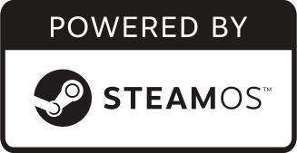

# Who is this guy?

::: biopic

:::

Software engineer and community builder

::: notes

I'm Colin Dean.

I've been a programmer for 27 years and a paid developer for 20 years this year.

:::

---

## {background-image="pittsburgh_on_a_map.svg" background-size="contain" background-color="#6699ff"}

::: notes

I'm here from Pittsburgh, a metropolitan area of around two and a half million people
in northern Appalachia in an area of the United States we call the Rust Belt.

:::

---

## {background-image="colindean_fosdem_2021_video_intro.png" background-size="contain" }

::: notes

This is my second presentation to FOSDEM, but my first in person and my fifth time attending FOSDEM in some way.

:::

---

{width=36%}
{width=36%}

::: notes

You can generally find me hanging out at the Homebrew table in the exhibition hall.
I've been a Homebrew contributor for 12 years and will complete my first term as one of its elected
Project Leadership Committee members on Monday.

So, hello from a fellow packaging project, but I know Nix is so much more!

:::

---

<!--
Please send me your questions!
-->

Please save your questions until the end.

<small>Grab a piece of paper so you can write them down.</small>

_This system matures frequently despite being in development for more than
a year._

::: notes

COLIN:

Please save your questions until the end.
We have a lot to cover and I need to keep pace to include all of it.
Please do shout out if you can't see something, though, or another technical
problem with the presentation occurs.

:::

---

## My Linux, 2001–2019 {.nocaptions visibility=hidden}

{height=2em}

{height=2em}

{height=2em}

::: notes

I've used Linux in varying degrees of committment since 2001.
My first distro was Trustix Secure Linux, running on some servers for Ultima Online run by some Danish friends I'd met through the player-run server community.
This is of course no relation to the Trustix system in Nix.
They gave me a login on their server and let me play around a little.
A few months later, I burned a Phat Linux live CD and
then my parents bought me a boxed copy of Linux for Windows,
a repackaging of Linux Mandrake live CD sold in the US for a few years.
By 2003, I was dual-booting Windows XP and Red Hat for about a year before
the first release of Ubuntu came out.

:::

---

## My Linux today {.nocaptions visibility=hidden}

{height=2em}
{height=2em}

{height=1em}

{height=1em}
{height=1em}

::: notes

I got "back to the Mac" in 2008 for my daily driver, having grown up on Macs
and being jealous of nearly infallible software suspend and clamshell
features of Mac OS X, something I'd struggled to get working on any Linux distro
of that era.

But, really, I was running Mac OS, Windows, and Ubuntu Linux plus this startup NAS vendor
called QNAP, whose hardware I wrote about for a tech website called ThinkComputers.

In the late 2000s, Linux became everywhere, mostly notably
in the form of Android and ChromeOS, which I happily adopted.

Like many people, I was using the operating system that was the most useful and comfortable
to me in the various contexts of my life:
gaming, programming, essential home computing as a service.
As a professional developer, I was and still am developing
mostly on macOS or Linux and deploying to Linux.

Eventually, there was a void in my life for a Linux desktop.
I don't remember exactly when this was, sometime in the late 2010s and before the pandemic.
I hopped a bit, settling on ElementaryOS for its stellar user experience,
especially having my preferences influenced by macOS for so many years.

I picked up a Steam Deck in 2024 and aside from playing with its desktop mode a little
because I'm the type to poke at things,
I'd not know that it's basically Arch Linux under the hood.

I've got Debian running on a bunch of systems,
including Windows Subsystem for Linux and chromeOS "Linux mode".

:::

---

## {.nocaptions .image-borders background-color=#aaa}

{height=1em}
{height=1em}
{height=1em}

{height=3em}
{height=3em}
{height=3em}

{height=2em}
{height=2em}

::: notes

I've used Linux in various forms since 2001 starting with Trustix Secure Linux,
spending more than a decade using primarily Ubuntu while also actively using macOS and Windows.
I currently split my time between Elementary and ChromeOS,
but have had an unexplored interest in NixOS and GUIX since first hearing about them around 2017.

:::

---

# {background-image=nixos.svg background-size=auto}

::: notes

Almost a year ago, I hastily picked up NixOS when I spotted a clear opportunity
to treat a shiny new NixOS installation as an appliance of sorts.
I threw together a makeshift system that was supposed to be very temporary.
I grabbed some unused hardware with a very specific advantage — a built-in LTE modem–
and reached for something I'd really only read about: NixOS.

:::

---

# Agenda

|   |   |
|---|---|
|Problem  ||
|Diagnosis||
|Remedy   ||


::: notes

I'm a huge fan of addressing problems through a problem-diagnosis-remedy
approach consistent with medical and other scientific approaches to problem
solving. If you search for "Colin Dean Problem Diagnosis Remedy" on the web,
you'll find my writings on it.

At a high-level, I'll be talking about a rather simple problem and diagnosis,
with a remedy… that remedy is why you're here!

:::

---

## Problem

Heating or cooling an empty house is wasteful.

I do not know when packages and contractors come and go.


::: notes

In February of 2024, just a few weeks after FOSDEM, I finalized the purchase
of a house about a 10 minute drive from where I'd lived for 12 years.
I immediately started renovation on this house built in 1968
with a high-end furnace installed in 1987.
It could fail at any moment, but it can heat the 185 square meter house from
15 degrees Celsius to 20 in about 40 minutes.
Being able to control it remotely, starting it when we were getting ready to leave
our then-current house, could be a game changer for our comfort while working there.

I was also to have a large number of packages delivered and strangers abound as new contractors
working on the house came and went,
so I wanted a doorbell camera for observation
and occasional interaction.

:::

---

## Diagnosis

* Need Internet, but easy options too expensive for need
* No mobile hotspot device
* No LTE modems

::: notes

The cheapest reasonable Internet service available to me cost around $50 per month.
At that price, I could choose between T-Mobile 5G with a 10 gigabyte data cap
or Verizon fiber at 300 Mbps with no cap.
T-Mobile's data cap wasn't sufficient for the doorbell camera's lowest quality setting.
Verizon's option was overkill when I really only needed around 31 kilobits per second
for the camera plus the thermostat's maybe half a kilobit per second averaged out over a month.

I didn't have a mobile hotspot device and most of what I saw was lackluster and frankly throw-away
quality for what I wanted to spend.
I also had some extra unused Raspberry Pis laying around, but no extra systems with an LTE modem.

:::

---

### {.nocaptions}

<!-- lightbulb -->
<span style="font-size:4em">&#x1F4A1;</span>
<span style="font-size:3em">
<!-- laptop -->
&#x1F4BB;
&#x1F4BB;
&#x1F4BB;
</span>

{width=25%}
{width=25%}
{width=25%}

::: notes

Then I remembered the three laptops I bought at Micro Center for a mere $60
during the 2022 recession of the COVID-19 pandemic in the US.
I remembered that a strangely expensive feature of them was an LTE modem in the M.2 slot.
Raspberry Pi were hard to come by during the pandemic and I devised some plan on the spot
when I saw them in the store.
I bought them with intent to sell the LTE modems for about $25 each and slot a SATA SSD,
and use them as a sort of a battery-powered cluster complete with a custom rack or something.
More horsepower, storage, and x86 compute, plus battery backup, for the cost of an entry-level
Raspberry Pi 4.
Not bad, Micro Center.

However, it became another ambitious project with cheap hardware forgotten
amid the other ambitions.

:::

---

## Remedy

Use a **low-cost LTE cellular provider** with an introductory rate of only $15/mo.

Use a **laptop with an LTE modem** purchased _new_ for $60.

Use **NixOS** `configuration.nix` to define the system,
_and nothing else_.

::: notes

After some searching, I found the laptops.
With some more research, I found that Mint Mobile, an US-based mobile virtual network operator
using T-Mobile's network, offered an introductory rate of just $15/mo for a 10 gigabyte monthly plan.
Their fine print seemed to indicate that overage was free, just with the speed reduced to something well
above my approximately 31 kilobit need.

Then NixOS was that thing that completed the idea.
The pledge was a single configuration file, and I wanted to see what the prestige would deliver.

:::

---

# Can I build a router in _one_ config file?

::: notes

Having built a router distro in college as my graduation project,
and having reviewed consumer networking equipment for several years a decade prior,
I knew a thing or two about the components I'd need.
I knew I'd need DHCP, DNS, a firewall,
and something to enable network address translation, masquerading, forwarding, and whatnot.

Assuredly, someone has done this on NixOS previously, I thought.

:::

---

# {background-image="evolve3nix1_with_accessories.jpg" background-size=constrain}

::: notes

Here's a picture of the Evolve3 laptop, a Maestro model with an approximately 29 centimeter screen.
The keyboard, trackpad, camera, and speakers are a step above garbage.
For the elementary students for whom this machine was made, they'd not really know the difference.
and the two USB ports — only one USB 3 — could work around those limitations.

I'd need an Ethernet adapter to plug it into the switch, but I had couple of those laying around.

:::

---

# {background-image="evolve3_inside.jpg" background-size=constrain}

::: notes

Everyone loves a good board shot.

This little machine has an Intel Celeron quad core processor at 1.1 GHz,
4 gigabytes of DDR4 RAM,
and a 64 gigabytes of eMMC storage.
I would come to learn while setting it up that the built-in WiFi drivers are
**NOT** included in the Linux kernel, and there was no Nix module for it.
So I pulled out a USB WiFi adapter that is,
mostly so that I could leave the Ethernet adapter in its LAN services mode.

I loved that it had a battery, too.
We were going to be toggling the electricity frequently as we replaced outlets and switches
throughout the house.
I avoided the need for a whole new uninterruptible power supply unit.

:::

---

# Values

* Inexpensive hardware could fail or be stolen
* Reproducible configuration
* Minimize administration
* Short-lived: 3–4 months

---

## Can my partner make this work if I am unavailable?

* Linux or Nix? No.
* Power cycle? Yes.

---

# Nix

---

## `hardware-configuration.nix`

```nix

{ config, lib, pkgs, modulesPath, ... }:
{
  imports = [ (modulesPath + "/installer/scan/not-detected.nix")];
  boot.initrd.availableKernelModules = [
    "ahci" "xhci_pci" "usb_storage" "sd_mod"
    "sdhci_pci" "rtsx_usb_sdmmc" ];
  boot.initrd.kernelModules = [ ];
  boot.kernelModules = [ "kvm-intel" ];
  boot.extraModulePackages = [ ];
```

---


```nix
  fileSystems."/" =
    { device = "/dev/disk/by-uuid/<uuid>";
      fsType = "ext4";
    };
  fileSystems."/boot" =
    { device = "/dev/disk/by-uuid/<uuid>";
      fsType = "vfat";
    };
  swapDevices =
    [ { device = "/dev/disk/by-uuid/<uuid>"; }
    ];
  networking.useDHCP = lib.mkDefault true;
  nixpkgs.hostPlatform = lib.mkDefault "x86_64-linux";
}
```
<small>…nothing special. Autodetect &#x1F44D;&#x1F3FB; <!-- thumbsup --></small>

---

## `configuration.nix`


---

# In practice

---

## LTE coverage

Enough.

---

## Throughput

Sufficient.

---

# Takeaways

---

## NixOS made this _svelte_

/svĕlt/

<small>_adjective_</small>

1. Slender or graceful in figure or outline; slim.
2. **Attractively thin**; gracefully slender.
3. Refined, delicate.

<small>_The American Heritage® Dictionary of the English Language, 5th Edition_</small>

---

# Attributions {.nocaptions}

* [Relief location map of the USA (without Hawaii and Alaska)](https://commons.wikimedia.org/wiki/File:Usa_edcp_relief_location_map.png), Uwe Dedering, 2010.
* Evolve3 Maestro desk picture by Colin Dean, 2024.
* [Evolve3 Maestro internal picture](https://imgur.com/a/ussxg8d) by Colin Dean, 2022.
* [Creative Commons "Attribution-Share Alike" license icon](https://commons.wikimedia.org/wiki/File:CC_BY-SA_icon.svg), Creative Commons, 2008.


---

## Logo attributions

* Red Hat Linux, Ubuntu, QNAP, Elementary logos owned by their respective companies.
* Trustix Secure Linux owned by Comodo.
* SteamOS logo owned by Valve Software.
* NixOS logo by Tim Cuthbertson.

---

# See also

* [Evolve III Maestro 11.6" Laptop Computer - Dark Grey](https://www.microcenter.com/product/683082/evolve-iii-maestro-116-laptop-computer-dark-grey?rd=1), Micro Center website.
* [Review: Evolve III Maestro E-Book 11.6"](https://www.reddit.com/r/linuxhardware/comments/tk6hdp/evolve_iii_maestro_ebook_116/) by `see_spot_ruminate` on /r/linuxhardware, March 2022.
