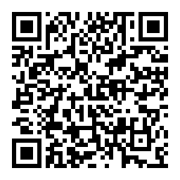

# Who is this guy?

::: biopic

:::

Software engineer and community builder

::: notes

I'm Colin Dean.
I'm a 2007 graduate of mother fair.
I was a Computer Science major with a minor in Creative Writing.
Which was mostly journalism.

Last year, I gave a much more flourishing establishment of my history at
Westminster, but in the spirit of sharing less, I'll keep that to a minimum.

I used to run The Holcad!
:::

---

Please save your questions until the end.

<small>Grab a piece of paper so you can write them down.</small>

::: notes

COLIN:

Please save your questions until the end.
We have a lot to cover and I need to keep pace to include all of it.
Please do shout out if you can't see something, though, or another technical
problem with the presentation occurs.

:::

---

## TL;DR {background-image=https://signal.org/assets/images/header/logo.png background-size="30%" background-position="center 90%"}

In 2025, use **Signal Messenger**
to communicate with anyone you can.

<https://signal.org>

::: notes

Signal Messenger is an chat system that
sends messages, video, audio, and more
only through end-to-end encrypted means.
Signal cannot see your messages.
When ordered by the government in court cases
to produce message data, they can produce nothing
useful more than a pseudonym of the recipient and a timestamp.

Signal is run by a non-profit with an endowment
that will probably outlast most of the people
in this room.

People far more interesting than most of us will ever
be have an interest in keeping this service running,
and ideally, free in perpetutity.

:::

---

<!-- warning emoji -->
&#9888;

::: notes

I want to stress the nature of _personal_ here.
I think my personal infosec (information security)
and opsec (operational security) are pretty decent.
I am not perfect, but I follow the recommendations of
security professionals and of some people whose freedom
depends on their ability to control their communications and data at rest and inflight.

:::

---

## If you remember nothing else, remember these.

Ask your ~~stochastic parrot~~ generative AI chat assistant about them later.

::: notes

One slide and a warning doesn't make for
much of a symposium talk,
so let's expand into some basics of
_personal_ information security.

:::

---

### Threat model

What activities do you do?

What data or traits do you have?

Who is the bad actor?

What resources do they have available?

**What can they do if they _got_ you?**

::: notes

(read slide)

I tend to separate actors into two kingdoms:
nation-state and everyone else.

If your threat actors, people who would act against you,
includes nation-states, like the United States,
your needs exceed what advice I'm comfortable giving
to you in this short presentation.
You should seek the advice of a certified security professional
or someone else with a similar threat model.

:::

---

### Trust boundaries

Safeguard your data

* in your own hands?
* in the hands of others?

::: notes

This talk is focusing on private communications.

Messages are typically stored for a while,
but if you're using Signal's disappearing messages
or Snapchat or Instagram stories,
those messages may be _ephemeral_,
meaning succinctly that they disappear eventually.

However, it's just data with an honesty timer:
once a message leaves your head, it's _said_.
Once a message leaves your device, your control,
you have to trust someone else with the message.
Even if the message is encrypted at rest and in transit,
it still has to be decrypted for your recipient to
understand it.

This expands your trust boundary: the systems and people
you can control and the same that you can _trust_,
even if you don't have direct control yourself.

:::

---

### Inherited risks

What risks do others pose to you?

::: notes

That control is not absolute.
I trust Mamma's Meatballs to get my pizza to me
within 45 minutes,

and they trust PennDOT to keep the roads clear,
but we all inherit the risks that weather
and bad drivers pose to me getting my food as ordered.

:::

---

### {background-image=https://img.nbc.com/sites/nbcunbc/files/images/2022/2/28/weakestLink_S2-Logo-1920x1080.jpg}

::: notes

Who's the weakest link?

:::

---

# let's unpack this

---

# {background-image=tinfoilhat.png background-size=contain background=#222}

::: notes

Now, let's dig more into these concepts,
as well as _why privacy_ in the first place.

No talk of privacy is complete without a tinfoil hat
reference, so here's that, fresh off of Facebook's
algorithmic feed bringing me timely humor.

:::

---

# {background-image=https://m.media-amazon.com/images/M/MV5BMjE0MjIwMDE2MV5BMl5BanBnXkFtZTgwMzM5MDQzNTM@.jpg background-size="contain" background-color=#000}

::: notes

There's an _excellent_ film made by Netflix
in 2018 that covers a lot of the _why_
of privacy.
Many years in the future, technology has progressed
to the point that everyone has an ocular implant
that provides an augmented reality view but also
records everything everyone sees.
All crime is recorded, so detective work is
simply a matter of figuring out who was present
and viewing their recording.

It all falls apart when some murders cannot be solved
because the murdered person's recording view shifts
to that of the murderer whenever the murderer
would be seen.

:::

---

> It's not that I have something to hide. I have nothing I want you to see.
>
> \- **The Girl**, Anon (2018)

::: notes

I'll not spoil the plot for you, because I actually
want you to go watch this movie over the weekend.

The supporting character, known as The Girl,
and played by the amazing Amanda Seyfried, says
this near the end of the movie.

This is a key idea of privacy:
you alone choose what you want to share,
and everything else should be _assumed_ private
and lawful.

:::

---

# Threat Actors

::: notes

Let's return to threat actors.

:::

---

Nation-states | Everyone else

::: notes

Recall from earlier my separation of these two.

We're going to talk about "everyone else" because,
well, if you're threat model includes nation-states,
governments might treat your individual rights more
like guidelines,
and you need the help of security professionals.

:::

---

## Everyone else

Nosy siblings & roommates

Controlling parents & partners

Loyalty-testing & union-busting employers

Corrupt law enforcement

::: notes

These are some examples,
from somewhat inconvenient trifles, up to people
with real power to alter the course of your life
if they're able to uncover your secret data, or, worse,
plant something in it.

:::

---

### {background-image="https://popicon.life/wp-content/uploads/2023/04/mcdonalds_hamburglar_2.png" background-color="#111" background-size="contain"}

---

## "Nothing to hide?   Nothing to fear"

---

> … a **logical fallacy** which states that individuals have no reason to fear or oppose surveillance programs
> unless they are afraid it will uncover their own illicit activities.
> An individual using this argument may claim that an average person
> should not worry about government surveillance, as they would have "nothing to hide".

<small><https://en.wikipedia.org/wiki/Nothing_to_hide_argument></small>

::: notes

A default position used to be to share everything
and hide only the things you didn't want people to see.

As our society has trended toward freedom,
it's important that we switch our mindset
and expect our policing to reflect that shift.

:::

---

### {background-image=https://losinterrogantes.com/wp-content/uploads/2020/11/anon-pelicula-4.jpg background-size="30%" background-position="bottom right"}

> You invade my privacy, it's nothing.
>
> I try to get it back, it's a crime.
>
> \- **The Girl**, Anon (2018)

::: notes

(read slide)

Dystopias suck for good reason:
they are nearly always authoritarian,
choosing to believe that there is something
rotten everywhere that the light doesn't touch,
instead of accepting that there may be
nothing there at all.
A panopticon -- an all-seeing eye -- is not the
solution for humanity.
Freedom is, and growth of humanity trends
toward it, no matter how much we may feel otherwise
in the dark moments.

:::

---

## Legal Threats from Nation-State Actors

EU "Chat control"

<https://fightchatcontrol.eu>

::: notes

While the challenges of using private communications
in authoritarian regimes in Asia may be well known,
there are still efforts across the world to
retain the idea that the government or corporations
must inspect everything.

The European Union's proposed "Chat Control" legislation
is an example of how politicians can try to trick
the public into surrendering the freedom gained
through encrypted communications.

:::

---

## outlaw… math?

---

### {.nocaptions}

<small><https://social.unextro.net/@ondra/115204461144155511></small>

---

# Trust boundaries

---

### Infosec

To whom do you give your contact list?

What services can access your data?

---

### Opsec

Is your computer and mobile phone storage encrypted?

Can you power off the device if it's taken from you?

How secure are the locks on your dorm, apartment, or house doors?

---

## {background-image=https://static.simonwillison.net/static/2025/lethaltrifecta.jpg background-size="contain" background-color=#000}

<!--
The Lethal Trifecta
* Access to your private data
* Exposure to untrusted content
* The ability to externally communicate (exfiltration)
-->

::: notes

Simon Willison, a highly respected software developer in the Python community,
talks about information security from time to time.
Lately, he's advisd some caution when trusting AI agents to act on your behalf.

Giving these tools, or any service, access inside your trust boundary opens you
to problems: given access to your private data and the ability to run instructions
that might not be in your best interest, and the ability to communicate externally,
and your security could be easily compromised even by accident.

:::

---

### Forward secrecy

It really means _backward_.

With FS, previously encrypted messages are secure from future communication errors, and vice versa.

Key expiration is important.

::: notes

Forward secrecy seems like a bit of a misnomer to the layman.
Really, it means that new communications -- forward communications -- cannot compromise past communications,
and generally vice versa.

Changing how the messages are encrypted periodically is a major part of this.

:::

---

Some threat actors are able to store encrypted messages for decryption **when the technology exists.**

::: notes

Quantum computing is becoming a thing, and some nation-states have the resources to store messages
in hopes that they'll be decryptable someday because of the promised high power of quantum computing.
Quantum computers work many orders of magnitude faster than our current technology,
reducing something that might take hundreds or thousands of years to decrypt to maybe minutes or hours.
So-called "quantum safe" encryption seeks to keep what's mathematically improbable, that way.

:::

---

# Inherited Risks

::: notes

Lastly, let's talk about those inherited risks.

:::

---

## Threats as a customer

::: notes

Companies who "take data security very seriously" fail customers regularly.
I've got 10 years of identity theft and credit monitoring because the US government's
security clearance processor was compromised years ago.

When you choose a communications provider,
you are a customer and you have to understand how your messages could be compromised.

:::

---

**Writing as you** is worse than **reading as you.**

---

## Threats from trusted people

::: notes

It's mostly from other people.
Business associates.
Partners, romantic and not.
When you trust them with communications, you're also trusting their
information and operational security,
their thread modeling,
their trust boundaries,
and their inherited risks.

You might be able to control for some or all of these,
but it's no longer a matter of someone shutting their mouth.
Keeping you safe from _your_ bad actors might mean your partners
having to put a more complex passcode on their phone than
one,
three,
five,
seven,
nine.
:::

---

## Threats from AI assistant technology

---

### Sharing may not be caring

> So there’s a profound issue with security and privacy that is haunting this hype around agents,
> and that is ultimately threatening to break the blood-brain barrier
> between the application layer and the OS layer
> by conjoining all of these separate services [and] muddying their data
>
> – [Signal President Meredith Whittaker](https://youtu.be/AyH7zoP-JOg?t=2856)

---

# Tips

---

Don't use or trust encrypted email.

It's become an anti-pattern.

<small><https://securitycryptographywhatever.com/2025/08/22/stop-using-encrypted-email-with-william-woodruff></small>

---

## {.nocaptions}

_Through the Web, Darkly_ by William von Hagen

<small><https://web.archive.org/web/20210929233853/http://www.vonhagen.org/darkweb.html></small>

---

## TL;DR {background-image=https://signal.org/assets/images/header/logo.png background-size="30%" background-position="center 90%"}

In 2025, use **Signal Messenger**
to communicate with anyone you can.

<https://signal.org>

---

# FIN

Thanks, yinz!

|   |   |
|---|---|
|**fediverse**|`@colindean@mastodon.social`|
|**bsky**|`@cad.cx`|
|**slides**|https://github.com/colindean/talks|

::: notes

Thanks, yinz.
There some Pittsburghese for you all.

:::

---

# Attributions {.nocaptions}

* [Creative Commons "Attribution-Share Alike" license icon](https://commons.wikimedia.org/wiki/File:CC_BY-SA_icon.svg), Creative Commons, 2008.
* [Tinfoil hats, Nick Trawick, comedian](https://m.facebook.com/story.php?story_fbid=24882926974636672&id=100000381397282)
* [Lethal Trifeca, Simon Willison](https://simonwillison.net/2025/Jun/16/the-lethal-trifecta/)

---

# See also

* [_Digital threat modeling under authoritarianism_ by Bruce Schneier](https://www.schneier.com/blog/archives/2025/09/digital-threat-modeling-under-authoritarianism.html)
