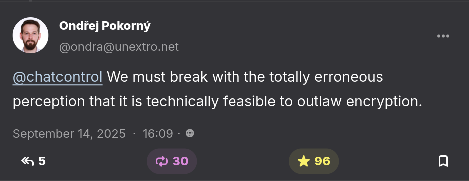

# Who is this guy?

::: biopic

:::

Software engineer and community builder

::: notes

I'm Colin Dean.
I'm a 2007 graduate of mother fair.
I was a Computer Science major with a minor in Creative Writing.
Which was mostly journalism.

Last year, I gave a much more flourishing establishment of my history at
Westminster, but in the spirit of sharing less, I'll keep that to a minimum.

I used to run The Holcad!
:::

---

Please save your questions until the end.

<small>Grab a piece of paper so you can write them down.</small>

::: notes

COLIN:

Please save your questions until the end.
We have a lot to cover and I need to keep pace to include all of it.
Please do shout out if you can't see something, though, or another technical
problem with the presentation occurs.

:::

---

TODO: WRITE THE TALK

---

## outlaw math

---

### {.nocaptions}

<https://social.unextro.net/@ondra/115204461144155511>

---

# FIN

Thanks, yinz!

|   |   |
|---|---|
|**fediverse**|`@colindean@mastodon.social`|
|**bsky**|`@cad.cx`|
|**slides**|https://github.com/colindean/talks|

::: notes

Thanks, yinz.
There some Pittsburghese for you all.

:::

---

# Attributions {.nocaptions}

* [Creative Commons "Attribution-Share Alike" license icon](https://commons.wikimedia.org/wiki/File:CC_BY-SA_icon.svg), Creative Commons, 2008.

---

# See also

