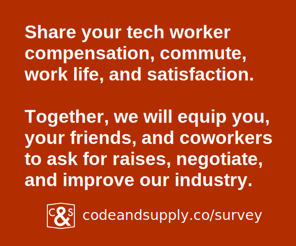
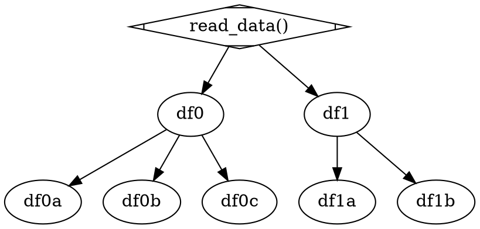

# Who are we?

{width=25%}
{width=25%}

Colin | Alex

::: notes

COLIN: I'm Colin, the managing director of Code & Supply.

ALEX: and I'm Alex, the lead engineer of the Code & Supply Compensation Survey project.

COLIN: We're going to talk about the data engineering effort that went into building the compensation survey for the 2022--2023 cycle.
       But first, I'm going to tell you some history of Code & Supply and the compensation survey.

:::

---


::: notes

COLIN: You've probably seen this logo around, it's ours! It's inspired by some of the railroad logos of the industrial revolution.

:::

---

* Meetups
* Conferences
* Co-working space
* Online communities
* Knowledge sharing projects

::: notes

COLIN:

We do a lot of stuff, mostly Meetups and our Online Communities on Slack and YouTube these days.
Maybe we'll do another 1,500-person conference in a few years.

The compensation survey is our primary knowledge-sharing project.

:::

---

# Compensation Survey

::: notes

COLIN:

Our compensation survey is a multi-iteration effort to capture a snapshot of
tech worker compensation, work-life balance, job satisfaction, commutes, and more.

:::

---



::: notes

COLIN:

The goal is to help C&S members and friends share information so they can make better decisions about their careers.
To date, dozens of people have told us how our report has helped them get pay bumps or negotiate better pay when changing jobs.
I myself have cited it in negotiation twice,
one time netting a 35% increase in base salary,
and the other time, netting almost 100,000 dollars in short and long-term incentives.

:::


---

# History

* 2016: started at a C&S Build Night
* 2017: first survey + report
* 2020: do it again (pandemic style)
* 2022: third survey
* 2023: 2022 report after a year of engineering

::: notes

The Compensation Survey grew out of a Build Night idea in 2016,
and I launched the first iteration in 2017 with 256 respondents and
about 500 lines of Ruby to produce a series of tables that
helped me and Justin Reese, Code & Supply's founder and owner, write two blog posts.
The table generation was repeatable, but I made all of the graphics in Apple Numbers.

In 2020, we kicked off a "Compensation Survey Working Group" and recruited almost a dozen volunteers to help...
and then the pandemic hit, and most volunteers were in the wind.
We still managed to get it out, though. We had around 750 responses.
Our process wasn't repeatable: one person did the graphs in their own Tableau account and became a bottleneck.
We asked a lot of questions, and our abandonment rate was higher than we'd like.
However, we automated builds of the report, which we wrote in Markdown and compiled into a PDF with Pandoc.

In 2022, we started again, slimming down the question set from 72 to 48
and engaged in real software development to build a framework for analysis.
It took a lot longer than we planned --
more than a year when we'd planned about four months --
but life got in the way for all of the volunteers,
so we did the best we could for that all-volunteer team.

:::

---

_not full time engineering, lol_

::: notes

COLIN DRINK WATER

:::

---

<!-- TODO: QRCode? -->

[`codeandsupply.co/survey`](https://codeandsupply.co/survey)

::: notes

Go download the report now!
It's more than 100 pages but it's a lot of graphs.

We're proud of the work we did with the scant resources we had -- $1,200 from sponsors and countless nights and weekends together and apart.

:::

---

## $

Sponsor us to make it happen

::: notes

If you're interested in funding a serious sponsorship to make this happen in 2024, please talk to me as soon as possible.
One of our core team members is currently looking for work and I'd love to hire them full-time to work on the survey but
Code & Supply can barely keep the lights on at our co-working space let alone fund a data science team.

:::

---

[`codeandsupply.co/join`](https://codeandsupply.co/join)

[`codeandsupply.co/coworking`](https://codeandsupply.co/coworking)

::: notes

You can help us afford more things by supporting us financially directly or coworking with us.

But now onto the meat of the talk: data engineering!

:::

---

# Agenda

1. Data collection
1. One-time data cleaning
1. Base analysis workflow
1. Tooling for writers
1. CI/CD
1. Future work

::: notes

COLIN:

The rest of this talk is going to be about the data engineering aspects of producing the report.
I'll talk about how we collected and cleaned the data,
how we built software to analyze the data and produce tables and graphics for inclusion in the report,
how we helped ourselves write the report with tools,
how we automated not only generating the report but also testing our software,
and where we want to go with it in the future.

:::

---

# Data collection

---


::: notes

ALEX:

We asked around 48 questions via Typeform, our survey tool of choice for longer surveys.
Typeform also captures all response data, enabling keeping data if a user abandons.
We saw very little abandonment in the 2022 survey, something around 1% whereas it was around 5% in 2020 if my memory serves me right.
2020 had 72 questions, 2022 was 48.

:::

---

### Questions, e.g.

* **"What is your base salary?"**
* "What is your expected total compensation?"
* "How satisfied are you with your compensation?"
* "In what postal code do you live?"

_48 questions_

::: notes

ALEX:

The only question that required an answer was the first one after the consent form, What is your base salary?

Many other questions dealt with compensation, where people live, their titles, roles, and so on.

:::

---

## C,S,V

::: notes

ALEX:

Typeform gave us a huge CSV dump that was one column per question for most questions but questions that allowed multiple answers were effectively one-hot encoded.
This felt complicated but eventually we understood it and worked it into our data cleaning and preparation steps.
We continue to hate CSV like everyone else and dreadfully wish Typeform et al. would offer something else.

:::


---

# One-time data cleaning

::: notes

ALEX:

We engaged in very little one-time cleaning, where we modified the stored version of our data.
Only really one of the questions in Typeform had a big cleaning issue due to the question being
freeform text, requiring just some direct cleaning (total compensantion is the question).

(Expand: Talk about total comp column if you have time)

We chose instead to have a data preparation step that filtered out invalid records,
handled pivoting one-hot encoded columns to lists,
and spat out a Parquet file for the data analysis code to consume.
A proper data format that now has a schema to work with, stores the data more uniformally, and that
our tooling can also easily load.

This data preparation step started out in pandas but eventually moved to Polars -- more on that later.

:::

---

# Base analysis workflow

---

{width=35%}

::: notes

COLIN:

We chose Jupyter notebooks as our development and runtime tool of choice.
It was my first time "using notebooks in production" ever and I think I recall Alex saying he's allowing it out of expedition and anger only.
I found developing directly in Jupyter to be cumbersome.
It wasn't until I used VS Code's notebook mode that I became far more productive, even as a daily IntelliJ user.

Having done some more outside of this with notebooks, notebooks in production was a bad idea.

:::

---

## Typical data exploration stack

* Programming with Python
* Dataframes with pandas
* Visualizations with Plotly

::: notes

COLIN:

We wrote our code in Python using pandas for data manipulation and filtration
and Plotly Express for visualizations.

No one is getting fired ever for chosing these tools.
They're a safe bet in the modern data science toolkit.

:::

---

## DataFrame programming

::: notes

COLIN:

A not-so-quick aside on dataframe programming.

:::

---


::: notes

COLIN:

We started on pandas because we had to start somewhere,
so we started with something familiar to someone.
Alex stubbed out much of the first pass.
I found myself fighting the pandas API because of my lack of experience with it
despite plenty of familiarity with Spark.

:::

---

### Switch

::: notes

COLIN:

That Spark familiarity had me briefly considering moving to Spark,
but then Alex heard of Polars about the same time that I did and he decided to switch with my full support.

:::

---

### Why switch?

---

#### Pandas

* Eager evaluation **by default**
* Slow evaluation in general
* API obtuse for non-Pythonistas

::: notes

COLIN:

Pandas may shift operations to NumPy, but far too often,
it doesn't and you're stuck in the land of the single threaded GIL and sadness.

I don't have any stats saved, but I recall that our Pandas implementation with only about 20 graphics was taking on the order of minutes to run the graph generation code.
This was rougher on my laptop, which is not the high-end gaming rig I have at home or that Alex carried with him as a laptop.
Given Alex's desire to learn something new and mine to use a friendlier API, we switched.

:::

---


::: notes

ALEX:

It wasn't a wholesale switch.
I rejiggered some new base methods in our analysis framework to return Polars Dataframes
and we set about building all new graphics on top of that module.

The improved developer experience of using polars was very quick and apparent.
It was… (CHEF'S KISS).

:::

---

## Polars Pros

* Expression-based API
* Lazy evaluation
* Optimized for embarassingly parallel selection and manipulation
* Few dependencies
* Easy migration path to Rust reimplementation
* Type hints and docs for all methods

::: notes

ALEX:

Polars presents a combination both friendlier and
more performant experience when working with dataframes.
For one this can include an expression-based API
(pretty much the builder pattern),
that leads to doing things in one way.
Add in a formatter like ruff — format on save if you can —
and your code is an order of magnitude more readable.

It benefited us also because of lazy execution that can better optimize our steps.
It can full do all the fun vectorized calls and
spread the work out onto every core making it embarrsingly parallelized.

With, of course in a way, the benefits all coming from Rust being binded over to Python.

:::

---

## Polars Cons

* Less battle-tested
* Completely different API from Pandas
* New to us

::: notes

ALEX:

Probably most major concern is, Pandas has really had a decade of work at it,
while this is just a few years brand new without a full stable release yet.
Though a stable 1.0 of Polars is on the horizon
and their breaking changes have slowed down.

The other side is the learning curve, since it's a new API for us to work with entirely.
But, this in some ways isn't that high of a concern as
Pandas in a way also has a decently large learning curve to it too.

:::

---

## So let's learn

::: notes

ALEX:

So let's learn this just a little in a sub sub tangent.

:::

---

## Polars vs `X`

TL;DR Best tool for single-machine data

_(and it's only getting better)_

<https://pola-rs.github.io/polars-book/user-guide/misc/alternatives>

::: notes

ALEX:

Polars aims to be and _is_ the best tool for single-machine data.
With more out-of-core features in development to allow processing
more data than you have memory for.

:::

---

# Real world examples

_(warning: code may have been broken when being shortened to fit the slides)_

::: notes

COLIN:

Here's a real-world example that's a little simpler than our comp survey use case.
I played around with Polars initially myself using voter registration data.

:::

---

```python
#pandas
def wilkinsburg_active_party_voters() -> pd.DataFrame:
  df = pd.read_csv(voter_data_path, sep="\t", header=0)
  df = df[df["MuniCode"] == WILKINSBURG_MUNICODE]
  df = df[pandas.to_datetime(df["Last_Date_Voted"]) >
    pandas.to_datetime(start_of_active)]
  df = (df[df["Political_Party"]
        == party_shortcode.value])
  return df[["Name", "StreetAddress"]]
```

::: notes
COLIN:

This reads a CSV file then filters to Wilkinsburg's municipal code,
further filtering by date last voted and then political party.

My biggest problem with pandas is the array reference structure.

SPOT THE BUG

:::

---

```python
# polars
def wilkinsburg_active_party_voters() -> pl.DataFrame
  all_voters = (pl.scan_csv(
    voter_data_path, has_header=True,
    sep="\t", parse_dates=False))
  return (all_voters
      .filter(pl.col.MuniCode == WILKINSBURG_MUNICODE)
      .filter(pl.col.Last_Date_Voted > start_of_active)
      .filter(pl.col.Political_Party == party_shortcode.value)
      .select(["Name","StreetAddress"])
      .collect())
```

::: notes
COLIN:

This is the same method, effectively, in Polars.

:::

---

```python
# polars
def wilkinsburg_active_party_voters() -> pl.DataFrame
  all_voters = (pl.scan_csv(
    voter_data_path, has_header=True,
    sep="\t", parse_dates=False))
  return (all_voters
    .filter(Cols.muni == Data.munis.WILKINSBURG)
    .filter(Cols.last_date_voted > start_of_active)
    .filter(Cols.party == party_shortcode.value)
    .select([Cols.name, Cols.street_address])
    .collect())
```

::: notes

COLIN:

This is the same Polars, but refactored using abstraction methods that we used in the comp survey.

Note the Cols and Data classes, each with a series of constants.
This enabled us to take advantage of autocomplete for developers to remember column names.

:::

---



::: notes
ALEX:

The structure of our notebooks' cells enabled us to call Polars methods and then call `to_pandas()` when needed,
which was generally when we handed a dataframe to Plotly -- it didn't yet understand Polars objects.

Though this has changed today, thanks to the Dataframe Interchange Protocol.
In a project started today, Plotly should understand how to handle the polars dataframe object.

:::

---

# Tooling for writers

* TODO finder
* Graphic locator
* Graphic use checker

::: notes

COLIN:

As Yvette and I did most of the writing,
we needed a way to ensure that we were using the graphs
that we were generating and to drop graphs that weren't useful.

This also helped us ensure that we made all the graphs we wanted
and track what we had left to do.

:::

---

# CI/CD

* Gitlab CI
* papermill for running notebooks
* parallel execution
* pandoc + lualatex for building PDF

::: notes

COLIN:

Code & Supply uses Gitlab, so we use Gitlab CI as our runner for this.

We used papermill for executing the notebooks, and found it to be less than desirable.
It worked but it'll be one of the first things we eject from the pipeline tooling when we can.
We used a thread pool to execute the notebooks with papermill in parallel and that helped a lot.
We started with a process pool but had problems in CI.

Lastly, we used pandoc to build the final PDF.
I've given a talk in the past about pandoc — A Documentation Workflow Loved by Engineers and Data Scientists Alike — so go find that on YouTube or FOSDEM's website for your consumption.

Frankly, Make really facilitated this.
We'd able to have a gaggle of Markdown files that pandoc concatenates
and then figures out how to massage into a PDF via lualatex.

:::

---

# Future work

* Refactor pipeline
  * Build more standard library functions
  * Standardize more appearance functions
* Completely eliminate pandas
* More graphs
   * Library of graphs given data inputs

::: notes

COLIN:

We intend to reuse this software for the next Compensation Survey.
We'll iterate and continue creating more convenience for developers.


ALEX: A lot of the work is creating more graphs and completely ejecting Pandas from the pipeline.

:::

---

## CODE TOUR

<!-- TODO: asciienma? -->

---

```python
class Columns:
    user_uuid = pl.col("user_uuid")
    base_annual_salary = pl.col("base_annual_salary")
    worker_classification = pl.col("worker_classification")
    equity_stock_option_grant = pl.col("equity_stock_option_grant")
    equity_rsu_grant = pl.col("equity_rsu_grant")
```

::: notes

ALEX:

This was probably one of the most useful patterns we surfaced in this effort.
Colin wanted autocomplete because he couldn't remember the question column names, so we came up with this.
This code could even be generated.

:::

---

```python
class Selects:
    career_is_manager_as_mgr_or_ic = (
        pl.when(Columns.career_is_manager == True)
        .then(pl.lit("Manager"))
        .otherwise(pl.lit("IC"))
        .alias("career_is_manager")
    )
```

::: notes

COLIN:

Based on the success of the Columns class as a collection of constants,
I built this similar class of select statements.
These are all testable, too: pull out a select, check it in a test.

ALEX:

Note here the "when" and "then" methods here.
This is a textbook way to build dead simple in-query manipulation like SQL.
This enables using lambda statements in a way that slows down pandas
and slows down the pandas-using dev.

:::

---

```python
@deprecated(reason="Use polars")
def load_csv_pd(filename: str) -> pd.DataFrame:
    logger.warning(f"Reading eagerly with pandas {filename}")
    return pd.read_csv(DATA_DIRECTORY / filename)
```

::: notes

COLIN:

While moving to Polars, we wanted primarily to get away from Pandas _reading_ any data.
We had a lot of Pandas manipulation code that we were too lazy to revise.
The read performance of Polars was just so much better that the Pandas code was made tolerable
by loading data with Polars.

We used deprecated extensively to find any outdated callers.
It's an incredibly useful tool that I've used extensively in Scala projects,
where it's built into the language.
I wish it was a part of the Python standard library.

:::

---

```python
def with_count_passing_filter(
    cls, df: pl.DataFrame,
    count_filter: Callable[[pl.Expr], pl.Expr]
) -> pl.DataFrame:
  assert Columns.user_job_title.meta.output_name() in df.columns
  return (
    df.select(Columns.user_job_title)
    .group_by(Columns.user_job_title)
    .count()
    .filter(count_filter(pl.col("count")))
    .sort(pl.col("count"))
    .reverse()
    .collect()
    .get_column("user_job_title"))
```

::: notes

COLIN:

This is a longer example of query.
We're checking that a column is in the dataframe,
and pulling that column name from the Columns constant's actual column name.

Then, we're getting the user job titles, counting them,
ordering by the count, reversing, and getting the titles.
We used this to order the labels passed to Plotly.

:::

---

```python
def execute_viz_notebook(notebook: Path) -> None:
  threading.current_thread().name = notebook.name
  output_notebook = f"{OUT_NB_DIR}/output_{notebook.stem}.ipynb"
  logger.info(f"START {notebook.name}")
  pm.execute_notebook(
    notebook, output_notebook,
    parameters={
        "artifact_dir": str(OUTPUT_IMAGE_DIRECTORY),
        "write_image_artifacts": True,
    },
    progress_bar=False, log_output=True,
  )
  logger.info(f"DONE {notebook.name}")
```

::: notes

ALEX:

This is our code that executes papermill,
passing parameters and not using the progressbar
because we're handling that at the top level on a per-notebook method above this.

:::

---

```python
X = 8
etc_with_yoe_lte_X = (
  only_full_time_within_range()
  .select(
    Columns.expected_total_compensation,
    Columns.career_years_of_experience)
  .filter(Columns.career_years_of_experience <= X)
  .collect()
)
```

::: notes

COLIN:

Here's an extract of a refinement on the salary data to graph just
expected total compensation and years of experience below a certain, configurable level.

The `collect()` call exists here because it's still a lazy-loaded dataframe until that moment.

:::

---


```python
fig = px.box(
    etc_with_yoe_lte_X,
    x="expected_total_comp",
    title=mk_title(
        f"Expected Total Compensation, <= {X} years of experience",
        limitations=only_full_time_within_range_text(),
        count=len(etc_with_yoe_lte_X)),
    labels={
      "expected_total_comp": "Expected Total Compensation"},
    points="all"
)
submit_figure(figure=fig, figure_name=f"etc_with_yoe_lte_{X}")
```

::: notes

ALEX:

And this is how we draw it.
The really cool part of this is the `submit_figure` method.
It will output the visualization to Jupyter _and_ write to disk for the report to consume.
It centralizes the file format and size for consistency.

:::

---


---

[`codeandsupply.co/survey`](https://codeandsupply.co/survey)

We need your data and your financial support!

::: notes

Go download the report now!

If you're interested in funding a serious sponsorship to make this happen in 2024, please talk to me as soon as possible.
One of our core team members is currently looking for work and I'd love to hire them full-time to work on the survey but
Code & Supply can barely keep the lights on at our co-working space let alone fund a data science team.

:::

---

FIN

---

<!--
<div id="player"></div>
<script type="application/javascript">
function showPlayerIfPlayerSlide(event){
  console.log(event.currentSlide);
  thisSlide = event.currentSlide.children.player != undefined;
  if(thisSlide) {
    player = document.getElementById('player');
    if(player.children) {
      Array.from(player.children).forEach((c) => {player.removeChild(c);});
    }
    console.log("creating the ascii player");
    AsciinemaPlayer.create(
      '/assets/631698.cast',
      player,
      { cols: 137, rows: 20 }
    );
  }
}
window.addEventListener("load", (e) => {
  console.log("load fired");
  Reveal.on( 'ready', (event) => showPlayerIfPlayerSlide(event));
  Reveal.on('slidechanged', (event) => showPlayerIfPlayerSlide(event));

});
</script>
-->

<script async id="asciicast-raHvx5Ll12BzPDVsmgbQxDsez" src="https://asciinema.org/a/raHvx5Ll12BzPDVsmgbQxDsez.js" data-autoplay="true"></script>

---

# See also

* [Cheatsheet for Pandas to Polars](https://www.rhosignal.com/posts/polars-pandas-cheatsheet/)
* [Polars Crash Course: Python's Library of Big Data Analytics](https://www.youtube.com/watch?v=aiHSMYvoqYE)
* [Allegheny County Voter Registration Analysis](https://github.com/colindean/allegheny_voter_reg_analysis)
