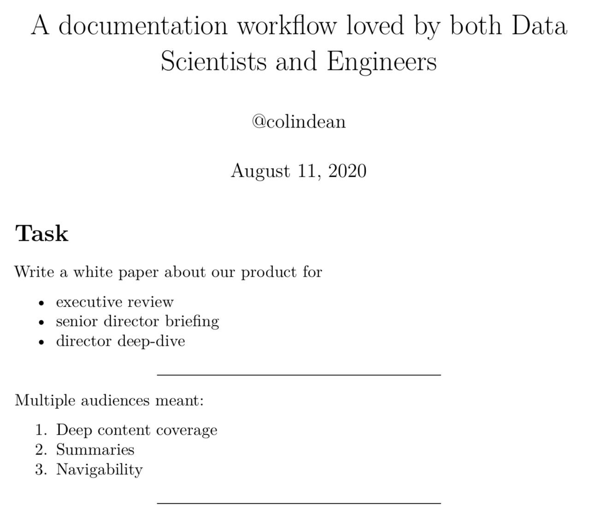

---
####
## NOTA BENE:
## :::Notes are not shown on slides, only on presenter view.
####
title: >
  A documentation workflow loved
  by both Data Scientists and Engineers
author: '@colindean'
date: August 11, 2020
theme: white
css: custom.css
slideNumber: 1
hash: true
history: true
transitionSpeed: "fast"
totalTime: 1800
# setup https://github.com/reveal/notes-server?
---

# I am Colin Dean.


---

> The views expressed herein are my own and
> do not necessarily represent the views of
> my employers or associated organization,
> past, present, or future.

---

<svg xmlns="http://www.w3.org/2000/svg" height="300" width="300">
<path d="M149 25a125 125 0 102 0zm2 100a25 25 0 11-2 0z" stroke-width="50" stroke="#C00" different-red='stroke="#E50024"' fill="#FFF"/>
</svg>

Lead AI Engineer at Target Corporation

::: notes
I'm based out of our tiny Pittsburgh office on Robotics Row in the Strip District.
:::

---

<svg xmlns="http://www.w3.org/2000/svg" viewBox="0 0 447 421.125" width="300" height="282.634228188"><path fill="none" stroke="#b22d00" stroke-width="15" d="M7.5 385.563V35.562l216-28 216 28v350.001l-216 28z"/><path fill="#b22d00" d="M126.094 100.422v21.562c-10.521-8.801-21.406-13.203-32.656-13.203-12.396 0-22.84 4.453-31.328 13.359-8.543 8.855-12.812 19.688-12.812 32.5 0 12.656 4.27 23.334 12.812 32.031 8.541 8.699 19.01 13.047 31.406 13.047 6.406 0 11.848-1.041 16.328-3.125 2.5-1.041 5.09-2.447 7.773-4.219 2.682-1.77 5.508-3.906 8.477-6.406v21.953c-10.418 5.887-21.355 8.829-32.812 8.829-17.24 0-31.953-6.016-44.141-18.047-12.136-12.135-18.203-26.77-18.203-43.906 0-15.364 5.078-29.062 15.234-41.094 12.5-14.739 28.672-22.109 48.516-22.109 10.832 0 21.3 2.943 31.406 8.828zM247.996 201.789l54.297 65.625 1.758-1.953a662.226 662.226 0 0016.602-18.75 495.367 495.367 0 0015.039-18.555l29.688 30.469c-3.646 5.209-8.432 11.264-14.355 18.164-5.927 6.902-12.988 14.844-21.191 23.828l55.859 68.945h-56.641l-30.078-36.914c-27.606 28.516-56.317 42.773-86.133 42.773-26.693 0-49.35-8.527-67.969-25.586-18.231-17.188-27.344-38.41-27.344-63.672 0-30.078 14.453-55.078 43.359-75l19.727-13.477c.26-.128.714-.455 1.367-.977a293.46 293.46 0 012.734-2.148c-19.922-21.222-29.883-42.12-29.883-62.695 0-20.312 6.641-36.847 19.922-49.609 13.541-12.759 30.987-19.141 52.344-19.141 20.703 0 37.823 6.186 51.367 18.555 13.541 12.372 20.312 27.997 20.312 46.875 0 13.022-3.711 24.805-11.133 35.352-7.293 10.547-20.507 23.179-39.648 37.891zm-36.133 25.586l-2.539 1.758c-18.622 12.891-31.317 23.242-38.086 31.055-6.641 7.812-9.961 16.082-9.961 24.805 0 12.5 5.011 23.959 15.039 34.375 10.416 10.027 21.875 15.039 34.375 15.039 17.578 0 37.823-11.523 60.742-34.57l-59.57-72.462zm9.766-57.617l3.711-2.734c6.378-4.815 11.651-9.015 15.82-12.598 4.166-3.58 7.159-6.607 8.984-9.082 3.906-4.815 5.859-10.742 5.859-17.773 0-7.94-2.67-14.386-8.008-19.336-5.341-4.947-12.5-7.422-21.484-7.422-8.203 0-15.106 2.539-20.703 7.617-5.6 4.819-8.398 11.005-8.398 18.555 0 8.856 3.516 17.578 10.547 26.172l11.328 13.672c.391.652 1.172 1.629 2.344 2.929zM412.875 111.906l-14.766 8.75c-2.762-4.791-5.391-7.916-7.891-9.375-2.605-1.666-5.965-2.5-10.078-2.5-5.053 0-9.246 1.433-12.578 4.297-3.334 2.812-5 6.355-5 10.625 0 5.886 4.375 10.625 13.125 14.219l12.031 4.922c9.791 3.959 16.953 8.789 21.484 14.492S416 170.031 416 178.312c0 11.094-3.699 20.262-11.094 27.5-7.449 7.293-16.693 10.938-27.734 10.938-10.469 0-19.115-3.098-25.938-9.297-6.719-6.197-10.912-14.922-12.578-26.172l18.438-4.062c.832 7.084 2.291 11.98 4.375 14.688 3.75 5.209 9.219 7.812 16.406 7.812 5.676 0 10.391-1.9 14.141-5.703 3.75-3.801 5.625-8.619 5.625-14.453 0-2.344-.326-4.492-.977-6.445-.652-1.953-1.668-3.75-3.047-5.391-1.381-1.641-3.164-3.176-5.352-4.609-2.188-1.432-4.793-2.799-7.812-4.102l-11.641-4.844c-16.512-6.979-24.766-17.188-24.766-30.625 0-9.062 3.463-16.641 10.391-22.734 6.926-6.145 15.547-9.219 25.859-9.219 13.907 0 24.766 6.771 32.579 20.312z"/></svg>

Managing Director

Code & Supply Co.

_(Abstractions, Heartifacts conferences)_

Secretreasurer

Code & Supply Scholarship Fund

::: notes
I run this Pittsburgh-based organization of
more than six thousand software professionals.
We run a coworking space in which we (normally)
hold Meetups, and we run some conferences you
may have heard of.
:::

---

<svg xmlns="http://www.w3.org/2000/svg" viewBox="0 0 1338.806 1180" height="266.165413564" width="300" version="1.0"><g fill="#111110"><path d="M322.39 1160c-28-26-29-73-2-100 42-42 113-11 113 50s-67 91-111 50zM922.39 1160c-44-41-15-120 43-120 31 0 75 41 75 70 0 28-43 70-73 70-13 0-33-9-45-20zM20.39 640c-28-28-27-84 2-104 51-36 111-6 111 56 0 59-72 89-113 48zM620.39 640c-11-11-20-33-20-50 0-65 79-94 119-44 27 35 26 59-4 89-29 30-68 32-95 5zM1226.39 639c-50-39-22-119 43-119 20 0 36 9 50 26 27 35 26 59-4 89s-54 31-89 4zM322.39 120c-28-26-29-73-2-100 42-42 113-11 113 50s-67 91-111 50zM922.39 120c-44-41-15-120 43-120 31 0 75 41 75 70 0 28-43 70-73 70-13 0-33-9-45-20z"/></g><g fill="#d1b32f"><path d="M457.39 1057l-18-33 97-168 97-167 35 3c35 3 38 7 132 168l96 165-19 33-19 32h-383zM235.39 840l-96-167 18-31 18-32h385l16 34 16 33-94 163c-93 161-94 162-130 165l-37 2zM835.39 838l-95-166 17-31 18-31h195l195 1 16 34c9 19 13 37 10 40-3 4-46 76-96 162l-90 156-38 1-37 1zM157.39 537l-18-33 97-168 97-167 36 3c35 3 38 6 126 160 49 86 93 160 97 163 3 4-3 22-14 41l-20 34h-383zM757.39 539l-18-32 97-168 96-169h37c34 0 39 4 58 43 12 23 55 98 95 166l74 125-16 33-15 32-195 1h-195zM535.39 320l-96-167 18-31 18-32h385l17 34 16 34-95 162c-93 161-94 162-131 165l-37 2z"/></g></svg>

President of the Board

Meta Mesh Wireless Communities

::: notes
I've been involved in this organization since its
humble beginnings as a bunch of kids trying to
build a city-wide mesh network. In 2020, we're
actually kinda getting there as we pivot to being
a non-profit Wireless ISP.
:::

---

# Task

Write a high-level overview about our product for

* executive review
* senior director briefing
* director deep-dive

---

Multiple audiences meant:

1. Deep content coverage
2. Summaries
3. Navigability

---

## A big change

---

<i style="font-size: 5em" class="fas fa-pause"></i>

---

Our product development was _paused_,
so we needed to document _everything_.

It may not be our team that continues
development.

---

## Audience and depth expansion

Detailed white paper for

* executive review
* senior director briefing
* director deep-dive
* **data scientists and engineers**

---

# Dramatis Personae

A team of seven colocateed data scientists and engineers

---

Lots of **engineering** detail: architecture, implementation

Lots of **mathematical** detail: equations, proofs

---

# Real need

A content-focused, scientific document authoring workflow
for Data Scientists and Engineers alike

---

# Thinking architecturally

::: notes
It's a good practice to figure out the things
that you value about a system before you start
building it.
:::

---

## Primary Values

* Reviewable content: prose and diagrams
* Content-focused with minimal markup
* Minimize structural exceptions with standardized styling and typesetting

---

## Secondary Values

* Accomodate some preferences for LaTeX over simpler formats (Markdown)
* Easy to use: one command to generate output
* Automation: artifact built from versioned, single master copy

---

**Treat documentation like source code.**

---

## Avoid at all costs

* Binary files
* Passing around a file
* Manual copy-paste to merge changes
* Difficult exports from wiki format
* Forcing everyone to (re)learn LaTeX

---

<i class="far fa-file-word"></i>
HighLevelOverview.docx

<i class="far fa-file-word"></i>
HighLevelOverview-COLIN.docx

<i class="far fa-file-word"></i>
HighLevelOverview-COLIN_20200626.docx

<i class="far fa-file-word"></i>
HighLevelOverview-COLIN-JAY.docx

<i class="far fa-file-word"></i>
HighLevelOverview-COLIN_20200626-FAN.docx

<i class="far fa-file-word"></i>
HighLevelOverview-FINALFINAL.docx

::: notes
That's right. We wanted to avoid this.
:::

---

# Solution

---

# `pandoc` + `git` + GitHub + Drone CI

---

## What this gets us

* Write in a simple text format
* Distribute changes and settle conflicts
* Review and suggest changes
* Push button to receive PDF, archived forever

---

## Biggest benefit?

LaTeX typesetting without ~~suffering~~ writing LaTeX

---

or, LaTeX when you _need it_

---

# `pandoc`, briefly

"A universal document converter"

---

## `pandoc`, less briefly

* 1.0 in 2008, 2.0 in 2017, 2.9.x in 2019
* Open source, GPL-2.0-or-later
* Written in Haskell with a Lua scripting engine
* 33 input formats, dozens of output formats

---

# `pandoc` basics

---

## Install

```shell
brew  install pandoc  # macOS with Homebrew
apt   install pandoc  # Debian/Ubuntu/Pop_OS
scoop install pandoc  # Windows with Scoop
crew  install pandoc  # Chrome OS with chromebrew
```

::: notes

pandoc is available in virtually every package manager
and there are downloadable installers available on pandoc.org

:::

---

## Invocation

```shell
pandoc document.md -o document.pdf
```

::: notes

pandoc attempts to figure out the input and output
formats based on the filenames, but oftentimes it's
better to be explicit.

:::

---



::: notes

This is an example output of running pandoc
on an early version of these slides,
which is written in Markdown and uses pandoc
to produce the code which comprises this presentation!

::::

---

## Real Invocation

```shell
pandoc \
  01_intro.md 02_problem.md 03_diagnosis.md \
  04_remedy.md 05_summary.md \
  --output documentation.pdf \
  --filter pandoc-crossref \
  --filter pandoc-citeproc \
  --lua-filter .filters/glossary/pandoc-gls.lua \
  --pdf-engine xelatex \
  --top-level-division=chapter \
  --number-sections \
  --toc --toc-depth=3 \
  -M lof -M lot \
  --bibliography=bibliography.bib \
  …
```

::: notes
Break down chapters and sections into separate files. Pandoc concatenates input.

Note the use of filters, the choice of PDF engine
that enables XeLaTeX in order to use Unicode and some other implementation-specific features.

Note the choices about table of contents, section numbering, lists of figures and tables, and bibliography.

:::
---

Most CLI options can be put into the YAML front-matter of the document.

---

```yaml
---
title: >
  A documentation workflow loved
  by both Data Scientists and Engineers
author: '@colindean'
date: August 11, 2020
theme: white
css: custom.css
---

# Task

Write a white paper about our product for

* executive review
* senior director briefing
* director deep-dive

```
---

## This presentation is written in Markdown

and converted to a Reveal.js presentation:

```makefile
PRESENTATION = document_workflow
MARKDOWN = $(PRESENTATION).md
HTML = $(PRESENTATION).html
DEPS_DIR = deps
all: $(HTML)

%.html: %.md
  pandoc \
    --to=revealjs --standalone \
    $< --output=$@ \
    -M revealjs-url=$(DEPS_DIR)/reveal.js/reveal.js-3.9.2
```
::: notes
Reveal and Powerpoint are supported first-class for output
:::
---

## Build system vs. a script

* Make
* Gradle

::: notes
Any sufficiently advanced build script eventually reimplements Make.
:::

---

## Common plugins

|Plugin|Purpose|
|------|-------|
|`pandoc-citeproc`|Processes citations, enables BibTeX use|
|`pandoc-crossref`|Enables cross-referencing for figures, equations, sections, etc.|
|`code-includes`  |Includes code from files instead of embedding|

::: notes
We've used citeproc and crossref extensively.
:::

---

## More plugins

Plugins written in Haskell, Lua, Python, and more

Loads more: https://github.com/jgm/pandoc/wiki/Pandoc-Filters

::: notes
Strongly recommend using Lua, which doesn't require
installing or compiling anything additional.
:::

---

## Diagrams

External or embedded

```markdown

```

```tex
\begin{figure}
  \centering
    \tikz{
      \draw[->, thick]{
        (0,0) -- (10,0)
      };
      \node[circle,radius=2pt,fill=blue] at (0,0){};
      \node[circle,radius=2pt,fill=blue] at (1,0){};
      \node[circle,radius=2pt,fill=blue] at (2,0){};
      \node[circle,radius=2pt,fill=blue, color=blue, align=center, label={[text=blue]Training Data}] at (3,0){};
      \node[circle,radius=2pt,fill=blue] at (4,0){};
      \node[circle,radius=2pt,fill=blue] at (5,0){};
      \node[circle,radius=2pt,fill=blue] at (6,0){};
      \node[circle,radius=2pt,fill=blue] at (7,0){};
      \node[circle,radius=2pt,fill=red, color=red, align=center, label={[text=red]Test Data}] at (8,0){};
      \node[circle,radius=2pt,fill=red] at (9,0){};
      \node at (11,0) {time};
    }
  \caption{Splitting time series data into training and test sets. Based on a graphic by Hyndman and Athansopouslos.}
  \label{fig:timeseries}
\end{figure}
```

::: notes

Images can be in a variety of formats. I tend to convert
everything to PDF and include the PDF version in the Markdown
because I know that PDF will look right versus SVG, because
SVG output rarely converts fonts to paths.

:::

---

## Citations

```markdown
As described in @hendry1995dynamic, we conclude that…
```
`--filter pandoc-citeproc`

`--bibliography bib.bib`
```bibtex
@book{hendry1995dynamic,
  title={Dynamic Econometrics},
  author={Hendry, D.F. and F, H.D. and Hendry, P.E.O.U.F.D.F. and Oxford University Press},
  isbn={9780198283164},
  lccn={gb95034438},
  series={Advanced texts in econometrics},
  url={https://books.google.com/books?id=XcWVN2-2ZqIC},
  year={1995},
  publisher={Oxford University Press}
}
```

::: notes

Using the pandoc-citeproc filter, we can easily enable
bibliographical references.

:::

---

# <i class="fab fa-git"></i>

* Distributed version control system
* Predominant/preeminent/prevailing use for software and more
* Great for text, not for binaries

::: notes

git was originally written to manage the Linux kernel
source code. Linus Torvalds himself wrote it!

but it was popularized in the late 2000s and early 2010s by…
:::

---

<i style="font-size: 8em" class="fab fa-github"></i>

GitHub

::: notes

GitHub is a widely used public website with
an on-premises version called GitHub Enterprise.

It's increasingly used internally by large companies.
:::

---

# Our workflow

::: notes
Next, I'll tell you about how my team used this powerful tool to create a workflow that enabled us to collaborate without having to pass around a file.
:::
---

## Four primary tools

|Tool|Utility|
|----|-------|
|`pandoc`|Write in a simple text format, Markdown|
|`git`   |Distribute changes and settle conflicts|
|GitHub  |Review and suggest changes, treat docs as code|
|Drone CI|Push button to receive PDF, archived forever|

---

### Flow of data

```{.graphviz caption="Git+GitHub workflow"}
digraph document_workflow {
  rankdir=LR;
  size="9,9"

  graph [fontname = "helvetica"];
  node [fontname = "helvetica"];
  edge [fontname = "helvetica"];

  node [label="Working Copy"]; edit
  node [label="pandoc"]; local_render
  node [label="Commited Work"]; commit
  node [label="GitHub"]; github
  node [label="CI"]; ci
  node [label="pandoc in Docker"]; remote_render

  github -> edit [ label = "Clone" ]
  edit -> edit [ label = "Write" ]
  edit -> local_render [label="Compile"]
  local_render -> edit [label="Fix"]
  edit -> commit [label="Commit"]
  commit -> edit [label="Refactor"]
  commit -> github [label="Push"]
  github -> ci [label="Check"]
  ci -> github [label="Validate"]
  ci -> remote_render [label="Compile"]
  remote_render -> github [label="Save Build Artifacts"]
  remote_render -> github [label="Notify of Build Errors"]

}
```

---

### Authoring

* Use a Markdown-specific text editor with preview
  * [PanWriter](https://github.com/mb21/panwriter), [MacDown](https://github.com/MacDownApp/macdown)
  * `vim` + `entr` + PDF viewer
* Writing one sentence per line makes review suggestions easier.

---

### Managing content

* One chapter per file - enables extraction
* Transforms necessitate a build directory

::: notes

When you limit relevant content to a single file,
you can deftly extract a single chapter or a few
into a single PDF. This is great for a summary PDF
or for testing only one file in a large document.

Our final paper, which was approximately forty five
pages, takes around 12 seconds to compile on my 2019
MacBook Pro. Compiling with only one section takes about
two seconds.

:::

---

### Committing

Use `git` commits to tell a story about the changes.

---

### Reviewing

---

#### Pull Requests

* Assign reviewers automatically with `CODEOWNERS`
* Choose submitter-merge or reviewer-merge

---

#### Continuous Integration

Block PR merging with CI system automation.

* Ensure valid markup and view changes compiled
* Run `proselint` or a grammar/spelling tool

::: notes

Every time I've not set up CI on a repo using this template,
someone has managed to merge to master something that breaks
the PDF build and it's been difficult to track down. I know
what to look for now – XeLaTeX doesn't like greek letters
inside formatting inside equations, apparently a no longer
necessary practice.

:::

---

#### GitHub's PR suggestions

* Push a button to accept changes
* Discuss suggestions, provide alternative suggestions
* Establish consensus on controversial suggestions

---

# Pain Points

---

## Pain getting started

* Dependency installation
* Learning Pandoc's flavor of Markdown
* "Why can't I just use LaTeX?"
* Converting from Word or LaTeX loses cross-references˚

<small><em>˚as of Pandoc 2.9.x</em></small>

---

## Productivity Pain points

* Incomplete WYSIWYG
* Bugs in workflow, sole developer stakeholder
* Equation writing workflow disjointed
  * Editor with TeX equations support
  * Separate renderer (LaTeXiT, MathJax.com)
  * Just render it

---

## Accomodating objections

* I want to use X
  * "But I want to use LaTeX"
    * only if you'll own that file!
  * "But I want to write my section in X and export it to Pandoc Markdown"
    * only if you can effect changes suggested in the PR

---

## Greatest risk of additional transformation tools?

---

### Overwriting.

Changes made to a file in the repo being overwritten by the output of an external tool's cost us _a lot_ of time.

---

# Feedback

_You don't have to take my word for it!_

---

## Positive

> "Leveled the playing field for contributions, great for collaborating and building documents with all of the features of LaTeX"

<small><em>\- PhD who loves LaTeX</em></small>

---

## Negative

> "I miss having fine-level control of figures, subfigures, positioning, etc."

<small><em>\- PhD who loves LaTeX</em></small>

---

# Current use

---

## Growing adoption

* Two large papers (45 pgs and 176 pgs)
* Several smaller papers
* Nearly two dozen authors

---

## Many tools

`pandoc`
`pandoc-crossref`
`pandoc-citeproc`
`MacTeX`
`XeTeX`
`Tectonic`
`Homebrew`
`librsvg`
`proselint`
`docker`
`pandocker`
`make`
`git`

---

# References and Attributions

* Icons by Font Awesome, https://github.com/FortAwesome/Font-Awesome. CC-BY-4.0 / SIL OFL 1.1.
