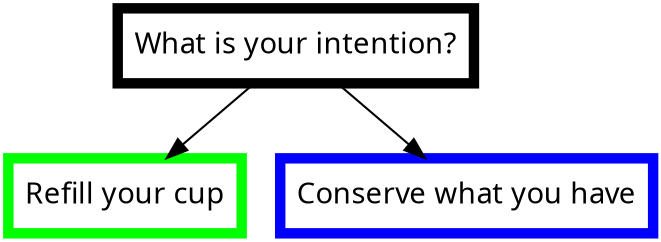
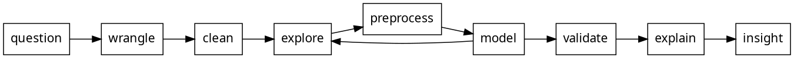

# day 1: workshops

---

# Establishing Good TDD Habits
<!-- NEW TALK -->

Brendan Enrick & Michael Richardson

---

### Survey of "writes tests" vs. "does TDD"

Most write, &lt; 10% TDD

---

### Takes discipline

* Builds understanding while recording thoughts
* Saves time vs. manual testing (time yourself!)

---

### TDD Cycle

```{.graphviz caption="Test-driven development cycle"}
digraph tdd_cycle {
  rankdir=LR;
  //size="9,9"
  //splines=true;
  layout="circo";
  beautify=true;

  graph [fontname = "Source Sans Pro"];
  node [fontname = "Source Sans Pro" penwidth="5"];
  edge [fontname = "Source Sans Pro"];

  node [label="Failing" color="red"]; red
  node [label="Passing" color="green"]; green
  node [label="Refactor" color="blue"]; refactor

  red -> green
  green -> refactor
  refactor -> red
}
```

---

### Kinds of testing

::: wordcloud

* Integration
* Unit
* Characterization
* UI
* Regression
* Functional

:::

---

### 100% coverage is unnecessary and brittle

---

### How to structure tests

* Arrange - set up initial state
* Act - perform action under test
* Assert - inspect system or results for correctness

::: notes

This makes it harder to write bad tests.

:::

---

### GIVEN `X`, WHEN `Y`, THEN `Z`

---

### Kinds of testing

* State-based testing: given input, expect output
  * Black box, don't care how output is produced
* Behavior-based testing
  * Concerned with workflow, actions performed
  * White box; cares how things are done within system
  * When I call `A`, I expect it to call `B` and `C`
  * Frustrating when system changes underneath

::: notes

Behavior tests tend to break a lot and make devs hate the tests.

:::

---

### Dependencies

::: wordcloud

* Databases
* File systems
* Web services
* Clocks
* Calendars
* Emails
* Messaging

:::

---

### Decoupling

* Inject dependencies
* Replace hard to test code with
  * fake objects,
  * mock objects, and
  * stubs
* Unit tests should only run _your_ code

---

### What is Pair Programming?

* **Two minds**, not four hands
* Collaborative effort
* Quality _improvement_; quantity of non-mundane tasks improves well
* Provides immediate feed on design and bugs
* Continuous code review

---

### Concerns

* "My partner will slow me down!" Yes! Good!
* "I'll slow down my partner!" Yes! Good!

---

### Desk setups for pairing - mostly bench seating

---

### When to pair?

---

### You already pair!

* When you ask for help
* When you get feedback
* When someone checks your work

---

### When shouldn't you pair?

* Mundane tasks
* Fixing simple typos
* Spike solutions (throwaway code)
* Non-dev tasks
* When you're sick: don't infect; take care of yourself first

---

### Pilot and Navigator

---

### When do you switch roles?

* Frequently, every few minutes

---

### Benefits of pairing

* Better code
  * Continual review - fewer defects and improved designs
* Knowledge sharing / transfer
  * Rapid onboarding of new team members
* Higher productivity / fewer distractions
* Improved communication

---

### Pair Programming Tips

* Collaborate and respect each other
* Setup effective work areas for two
* Alternate roles frequently
* Stay engaged and communicate frequently; think out loud
* Observe physical bubble, lol

---

### LOTS OF PAIRING WITH TDD

---

### Naming Unit Tests

1.
1. Put feature name in the test class/method name
1. Use underscores (`_`) in test names
1. Test cases to simplify names

---

### Continuous Integration

* Automating the integration of code change _continuously_

---

### 5 Rules of Simple Design

* KISS (Keep is Simple Stupid)
* DRY (Don't Repeat Yourself)
* Separation of Concerns
* Explicit Dependencies
  * Methods/classes should explicitly require anything they need

---

### Pain Driven Development

* Don't try to apply every principle, every time
* Follow principles when their violation is causing you pain
* The _third time_ you do it, **refactor**

---

### Design Patterns

---

### Learning Structural Pattern Matching in C\#

```csharp
sortedDice switch {
  [_, _, 1, 1, 1, 1] => 1000
  [6, 6, 6, _, _, _] => 600
  [_, 1] => 100
  [5, _] => 50
}
```

_(It's in C\# 11, we're using 10)_

---

### Katas

https://brendoneus.com/katas

---

# Introduction to Soldering
<!-- NEW TALK -->

Jameson Alea (@jameybash)

---

### Joints

* Triangle - good
* Ball - too cold
* Incomplete cone - not enough solder
* Touching another solder - short, bad

---

### If you mess up

* Solder sucker - pressurized vacuum
* Heat gun - reflow

---


---

# day 2: workshops

---

## Mastering TDD in Legacy Code
<!-- NEW TALK -->

* Brendan Enrick
* Michael Richardson

---

### "I can't test first, because I'm working with legacy code"

"Yes, you can."

---

### What is legacy code?

* Bad? Rotten? Inherited?
* Any code that exists?
* Code we're afraid to work with?
* How can we prevent code from becoming _legacy_?

---

### "Working Effectively with Legacy Code"


by Michael C. Feathers

[_free on archive.org_](https://archive.org/details/working-effectively-with-legacy-code/page/n11/mode/2up)

---

> Legacy code is often hard to change and dangerous to change but somethings we have to change it.

— Brendan Enrick, this slide, 2023

---

### Characterization testing

Learning characteristics of an existing system through testing.

A form of "black box testing"

Sometimes called "Approval Testing"

---

## Howto

1. Get code running in a test - safely refactor first if needed
2. Record as many results of the code as you can
3. Assert those results in your test
4. Repeat 2–3 for various cases, including edge cases

---

### Kinds of testing

::: wordcloud

* Integration
* Unit
* Characterization
* UI
* Regression
* Functional

:::

---

### Unit tests

* Run in isolation
* Single method or function, ideally

---

### Integration tests

* Test interactions
* Confirm infra works
* Slower than unit tests
* Can be run frequently
  * Run before push

---

### UI Tests

* Verify entire features
* Slow, but still automated
* Often defined by customer
  * May be written by customer
* Ideally run before merge

BDD - Playwright, Cypress, Selenium

---

> But in all my other TDD sessions, they said to use mostly unit tests!! There was that pyramid!!

That's ideal, but we're in **legacy** code, not _ideal_ code.

---

### Exercise

<https://brendoneus.com/katas/#gilded-rose-refactoring-kata>

---

> All refactoring, even "safe" refactoring, has risk.

---

### General Refactoring Tips

* Keep changes small
* One-at-a-time
* Make lists
* Commit changes often
* Add extra test cases
* Review, don't assume your change is better

---

### Pain Driven Development

* Don't try to apply every principle every time
* Follow your principles when their violation is causing you pain
* The third time you do it, **refactor**

---

### When should you refactor?

Would you eat at a restaurant that hasn't cleaned its tables in six months?

Clean up every time.

---

### When?

* Following TDD? Red, green, refactor!
* Pain Driven Development
* When adding new, related code
* When fixing bugs

---

### When _shouldn't_ you refactor?

* With legacy code (i.e. not tested) - safest, minimal refactoring only
* When the code is broken
* When a deadline is reached/here

---

### Steps to change legacy code

1. Write any tests you can write — high-level if needed.
2. Extract code you can test
3. ???
4.

---

### Examples of Safe Refactorings

* Rename class, methods, property
* Extract code: methods, classes, interfaces
* Invert boolean logic (if statements, etc.)
* Introducing fields, properties, constants
* Create method overload / add default parameter

::: notes

Be wary of API changes affecting downstream consumers.

:::

---

### What do we need to change to let us test those hard-to-test methods?

### Dependencies and Interfaces

* Deps are any constructs the system under test must work with to perform its
    function
* Deps are transitive: if A -> B and B -> C, then A -> C

---

### Dependency Injection

* Constructor injection (preferred)
* Parameter injection
* Property injection

---

### Constructor Injection

* All deps declared in constructor
* May be required, may have defaults
  * Defaults are "poor man's dep inj"
* Each arg sets a private field
* Follows Explicit Deps principle

---

### Parameter Injection

* All deps declared as method parameters
* Use for deps used by only one method

---

### Using Shims to Test with Static Calls

* Shims replace the behavior of a method
* Often override methods, properties, incl. static and non-virtual methods
* Why "shim?"
  * You insert your shim between your code and the code it calls.

---

### Mob programming exercise

Add capability to return multiple ticket pricing total in a ski lift ticket API

**Write characterization tests!**

---


## Intro to Game Development with Godot
<!-- NEW TALK -->

Brandon Lewis

---

### What is Godot?

* Wide supported
* GDScript high level, dyn typed
* VCS firnedly
* FOSS
* No Vulkan or Direct3D
* Not as mature as other frameworks

---

### Notable games

* Brotato
* Dungeoncraft
* Dome Keeper

---

### Goals

1. Controllable Player
2. Reusable base level
3. Player & LEvel Polish
4. Level checkpoints
5. Hazards and player respawn
6. Collectibles & HUG
7. Base enemy
8. Main menu

---

### LAB

(I made a video game!)

(A bad one!)

(First step to making a good one!)

---


---

# day 3: presentations

---

## Flour Water Elixir
<!-- NEW TALK -->

Ole Michaelis

---

### Make sourdough, with sensors

---

### Distance sensors

---

### Sonic bad, laser good

---

### Too hard to use for average user

---

### Not more effective than rubber band on jar method

---

## Debugging burnout
<!-- NEW TALK -->

Sam Shaw

---

### Maslach Burnout Inventory

* 22 Q in v1
* Occupation burnout

---

### WebMD on Burnout

* Overload burnout - work harder toward franticness
* Under-challenged burnout - underappreciated
* Neglect burnout - lack of attention

---

> Imbalance of energy in expectations and environment

---

### Physics

Amount of energy required increases exponententially in many interactions

---

### Establishing core values

Personal Values Card Sort

Miller, C'de Baca, Matthews, et al., Univ. of New Mexico, 2001

---

### Addressing Core vs the Symptom

- Are you solving the types of problems you want to solve?
- Is you env violating a core value?
- Are you using a sledgehammer where a scalpel is needed?

---

### Mood meter

Energy: High - Low
Feelings: Unpleasant - Pleasant

_Permission to Feel_, by Brackett

---

### Tool: Carding

Track tasks

---

### Bug: I don't know where I want to be

---

### Goal Setting

---

### SMART vs VAPID

* Specific, Measurable, Actionable, Responsible, Time-bounded
* Vague, Amorphous, Pie in the sky, Irrelevant, Delayed

::: notes

"Running the company" - bad goal, insufficient control

:::

---

### Routines vs Habits

* Routine - Sequence of actions you carry out the same every time
* Habits - Autopilot Routines set off by triggers

---

### Tool: Breakpoints

Pause and look, what's getting in the way?

---

### Bug: When I make changes, life gets in the way

---

### Themes

* Intentionally Vague
* Trendline
* Set times: "Winter of Balance"

---

> A year is a perfect amount of time to do nothing.

---

### Seasons

Balance

proactive versus retroactive or reactive

---

### Resonance

---

### Tool: Estimations

Give flexibility in your timelines

---

### Bug: I'm tired of failing

---

### Growth Mindset

_mindset: The New Psychology of Success_, by Carol S. Dweck, PhD

Fixed vs Growth

---

> Everything is an interation. Slow down, figure out what the next iteration may be.

---

### Dialogical

_Using dialogue to come to a shared understanding_

Talk toward the root cause, not just addressing the symptoms.

---

### Tool: Root Cause Analysis

What is the core issue at hand?

---

### Energy: Collect and Protect

---

### Bug: World sucks, why bother

---

### Gratitude

_The Science of Well-Being_, by Yale University

---

Think of 5 things for which you are grateful. Write them down.

---

### Emmons & McCullough (2010)

| | Gratitude | Hassles | Events |
|---|---|---|---|
|Life as a Whole| | | |
|Upcoming Week| | | |
|Physical Symptoms| | | |
|Hours of Exercise| | | |

::: notes

Good things: had a good cup of coffee, made all the green lights on a trip

:::

---

### Exercise: Write down 3 things you're grateful for

Me:

1. Freedom to conference (submit, speak, attend)
2. Friends who listen
3. People who share information

---

Write & Deliver a note of gratitude to someone.

---

Measureable difference in happiness lasts one to three _months_ after sending
the note.

---

### Tool: Pairing

Have someone(s) to challenge and refine your perspective

---

### Bug: My Hobbies Have Become Chores

---

### Finding your energy



---

### Refill your cup

* What do you do to relax?
* Hobbies are not side hustles
* Be a "white belt" in something
* Pool table (best debugging tool!)

----

### Conserve what you have

* Hobbies are important
* Vacations/Explorations are important
* Work/Life balance is important
* Do you have any analog hobbies

---

Build a Lego kit.

---

Go for a walk in a park.

---

### Tool: Retrospect on Hobbies

Are past decisions still serving you?

---

### Things to watch out for

* Sunk Cost Fallacy
* Survivorship Bias
* Confirmation Bias

---

### What to build

* Myelin - brain
* Routines
* Habits

_The Talent Code_, by Daniel Coyle

---

### Get debugging

Burnout is hard

There are three dials to turn

I've not figured this out, this talk is a snapshot on a journey

---

### Keep the conversation going

---

## Why Data Science and UX Research Should Be Best Friends
<!-- NEW TALK -->

Grishma Jena

Data Scientist - Insights, UX Research Ops
IBM

---

64.2 quadrillion gigabytes of data collected in 2020 worldwide
80% is unstructured data
2% is saved or retained

\- Statista & IDC

---

You're not going to like using software if it's too difficult to use.

Overwhemling with options, clunky workflows, etc.

---

UI: screens, buttons, toggles, icons, visual elements

UX: End user interaction with product, system, service, incl. perception of
utility, ease of use, efficiency

UR: Methodology of assessing UX to produce better UI

---

### IBM Design Thinking

Human-centered approach to understand users, challenge assumptions, redefine
problems, and creative innovative solutions to prototype and test

---

### Answer questions with UI data

* Who are the next 1,000 customers we're going to lose?
* Where can we make a workflow more efficient by reducing clicks?

---

Structured vs Unstructured vs Semi-structured

---

### Data management



---

### Case studies of DS + UX success

---

#### Airbnb

**Host preferences:** Larger city hosts wanted 100% occupancy, smaller cities hosts preferred many shorter stays with a day or two of unoccupied time

**Bounce rates**: Asian visitors would get distracted by pictures and forget to book, redesign showed top pictures around the area and led to 10% conversion lift

**Skewed search**: Look at tourist hotspots in data, suggest those places to stay

---

#### Too many tags

One team had human labelers equipped with 30+ tags

Used some CV + ML to expedite and switch humans to verification, much faster

---

#### Google

DL for usability testing to predict tappabilty of events

90% of human performance predicting tappability

----

#### Spotify

Detect anomalies in skip feature

One user skipping exactly six ads when they could skip unlimited

Turns out user thought conflated song and ad skips

---

### Better together: DS + UR

Different angles, different data sources

Same goal: increase user happiness resulting in meeting business objectives

---

> Things get done only if the data we gather can inform and inspire those in a position to make a difference.

\- Dr. Mike Schmoker, author

---

### Do these

* Find DS or UR in your company
* Discuss pain points and brainstorm
* Start small; create prototypes
* Get buy-in from executives

---

## How Not to Strangle Your Coworkers: Resolving Conflict with Collaboration
<!-- NEW TALK -->

Arthur Doler

---

Conflict sucks.

Defensive avoidance sucks.

---

### Task Conflict

Can be good conflict.

---

### Process Conflict

Can be good, too.

_Do we have the right people in the room and in authority?_

---

### Relationship Conflict

Personal reasons.

Always extremely bad.

Starts bad, gets worse.

---

### Conflict can be external, too

---

### Psychological Safety

Not interacting and depending on each other could mean death.

---

#### Toxic positivity

---

People **hold back** when they do not have psychological safety.

---

> Teams with psychological safety can service hidden conflict.

---

### Not top down

Psychological safety cannot be established at organizational levels.

It must be at _interpersonal_ level: teams, workgroups, etc.

---

### _the fearless organization_, by Amy C. Edmonson

seminal work on psycholocal safety

---

1. Set the stage
2. Invite participation
3. Responding productively

---

### Set the stage

---

#### Complex failure

a.k.a. System Breakdowns

Def. Unique and novel combinations of events and actions that give rise to unwanted outcomes

> Celebrate failure by recognizing catching risk early

---

#### Intelligent failure

a.k.a. unsuccessful trial

Def. Novel forays into new territory that lead to unwanted outcomes

> Failure of creative and innovative work… recognize that you've learned something

---

#### Taxonomize your task

> Be careful not to mistake complex for preventable

---

| | Default Framing | Reframing
|---|---|---|
|The boss|Has answers, gives orders, asssess others' performance | Sets direction, Invites input to clarify and improve, Creates conditions for continued learning |
| Others | Subordinates who do what they're told | Contributors with crucial knowledge and insight|

---

#### Emphasize a sense of purpose

---

### Invite Participation

---

#### Demonstrate situational humility

The need for humility lies in the situation.

> Power can change people.

---

#### Practice inquiry

Naive realism = belief that ones understansd all things they perceive, so they believe they understand everything

---

#### Rules for a good question

1. You don't know the answer.
2. You ask questiosn that do not limit responses to Yes or No.
3. You ask questions in a way that allows for explanation.

---

#### Behavior of leadership inclusiveness

---

Staff should be learners and teachers.

---

### Responding Productively

---

#### Express appreciation

---

#### Destigmatize failure

---

||Traditional Framing|Destigmatizing Framing|
|---|---|---|
|Concept of Failure|Failure is not acceptable|Failure is a natural byproduct of experimentation|
|Effective Performance|Effective performers don't fail|Effective performers produce and learn from and share the lessons from intelligent failures|

---

||Traditional Framing|Destigmatizing Framing|
|---|---|---|
|The Goal|Prevent Failure|Promote fast learning|
|The impact|People hide failures to protect themselves|Open discussion, fast learning, innovation|

---

#### Sanction clear violations

Thoughtful, respectful punishment

---

> Stuffing emotions in a bag does not make them go away.

---

Most developers are men.
Men are not taught how to manage our emotions.
Our forebears allowed expression of anger.
So anger is what we express.
**Change that.**

---

### Models of achievement

I

II

---

#### Model I

To win in zero-sum game

I can't win unless you lose

Self-fulfilling prophecy

Self-sealing process

---

Drag emotions out from the team by

**Offering explicit points to talk about emotions.**

Non-passive-aggressively, of course.

---

#### Model II

Builders, offering something constructive.

We can all win.

---

### Beware of attachment

Task conflict can be come relationship conflict

---

### Confrontational Styles

1. Avoiding
1. Yielding
1. Fighting
1. Coooperating
1. Conciliating

---

#### Avoiding

* Strictly passive approach
* Hope that problems solve themselves
* Rather than discuss conflict, they change subject, reschedule, etc.

---

#### Yielding

* Passive, pro-social approach
* Solve large

---

### Fighting

* Active, pro-self approach
* Use competitive, powerful tactics to intimidate
* Uses mandates, challenges, etc.

**Model I**

---

### Cooperating

* Active, pro-social, pro

**Model II**

---

#### Conciliating

* A mixed approach

---

### Handling conflict as an Individual Contributor

---

Actions of a single member can affect the whole group.

Must be in good standing.

---

Do not lead with dissent.

It leads to dismissal, implicit or explicit.

---

> Power can make you look at people with less power as a problem to be solved.

---

### Goals vs Position

Goal: thing a person wants to achieve

Position: how they've envisioned achieving that goal

---

> Seek first to understand, then to be understood.

\- 7 Habits of Highly Effective People

---

Choosing conflicts is challenging, exacerbated by system inequities or externalities only you can perceive

---

<https://bit.ly/art-collaborative-conflict>

---

# day 4: conference

---

## Aerospace Engineering for Computer Scientists
<!-- NEW TALK -->

Ilyana Smith

---

### History of Manned Spaceflight

1. Gemini
2. Apollo
3. Space Shuttle
4. Artemis
5. _future_

---

### Artemis Delays

2011 start

2016 planned

2022 actual

---

### Super Guppy plane to transport module from Florida to Sandusky, Ohio for testing

---

### Shipping is a Feature

> Change in public opinion was impressive

---

### History of shipping failures

---

### Redundancy & Voting

Three computers > one

Weight of one computer > three

---

### SRAM > DRAM

---

### Feature size

Perserverance feature size: 200 nm

Apple M1 feature size: 5 nm

Smaller features = more susceptibility to radiation

---

### KISS

> Don't build a Rube Goldberg machine

---

### International Space Station

Launched 1998

Manned since 2000

---

### Antipattern: Spaghetti Code

If one thing breaks, everything breaks. What broke?

---

### Commoditization of Satellite Deployment

Standarization into cube sats from "build everything yourself"

---

### Componentization of Spacecraft

5 different countries, many different companies

Components never came near each other until fitted together _in space_

---

### Separation of Concerns

> Don't use the airlock for storage.

> If you use your fridge to store bleach, please don't do that.

---

### Dependency Inversion Principle

> Modules should depend on interfaces, not implementations.

---

### Apollo program

Apollo 1: 1967, failed on plugs out test, 3 dead

---

### Testing is a Balance

Materials in pressurized capsule burned twice as fast, unacceptable safety margin

> In a safety critical system, test, test, test.

---

### Apollo 11

Lunar landing. Apollo Guidance Computer.

Literally hardwired with numeric interface for command entry.

---

### Summary

1. shipping is a feature
1. update the plan
1. keep it simple
1. separation of concerns
1. dependency inversion

---

## Market Rate
<!-- NEW TALK -->

Yvette Menase

---

## The Price of Open Source

<!-- NEW TALK -->

Mathias Koch

---

### NUKE build automation framework for .NET

---

### GitHub Sponsors

---

### NUKE made the Thoughtworks Technology Radar

Trial phase

---

### Timeline of open source

---

### Companies save $60B p.a. because of open source

---

### Open Source Initiative

* Propretiary software is the "enemy"
* OS is a trademark
* OSI-approved licenses
* Designed to maximize consumption

---

### Types of OSS

* Hobbyist
* Side gig
* Ancillary project
* Professional project

_Decreasing risk of adoption as top-bottom_

---

### Actors

* Maintainers
* Consumers
* Contributors

---

### The Good and the Bad

---

### Good: Maintainer opportunities

* Better dev ("five years of experience in one")
* Great for CV
* Networking & Reputation
* Visit conferences for free
* Receive Awards
* Money / Business (hard work && luck)

---

### Consumer Benefits

* Lower cost of ownership
* No licensing costs
* Security
* Agility
* **Standing on the shoulders of giants**

---

### Bad: Maintainer Responsibilities

* Development & Research
* Application of Best Practices
* Documentation & Website
* Security

---

### Consumer Risks

* Intellectual property
* Security
* Lack of support
* Abandonment


---

### Maintainer Risks

* No users
* Entitlement/Abuse
* Embrace, Extend, Extinguish - AppGet (OSS) vs WinGet (Microsoft)
* Victim of own success - project popularity and maintenance costs tend to rise linearly

---

People are not willing to try to get their company to pay for OSS.

---

### Takeaways

* Little to no contributions back
* Sustainability of projects
* Cost of maintenance
* No business alignment

---

### General Advice

* Believe in yourself
* Take your time
* Integrate with existing tooling

---

### Ramping up

* Pick a license, probably start with MIT
* README with elevator pitch
* Contribution Guidelines (copy, but alter)
* Code of Conduct
* Security Policy
* Community Space (probably Discord right now)

---

### Get OSS licenses

* Azure credits
* Jetbrains IDEs
* SignPath Code Signing
* CI/CD Services


---

### Coding practices

* Create high-level tests
* Maintain a changelog
* Setup CI/CD pipelines
* Start with version 1.x
* Don't carry old weight

::: notes

John Skeet advocates starting with 1.x instead of 0.x to avoid exceptional
cases or never moving on from 0.x

:::

---

### Telemetry

---

### Promotion

* Twitter, reddit, LinkedIn
* Discord, Slack
* Stack Overflow
* Newsletters
* Community Leaders & Standups
* Conferences & Meetups

---

### Content

* Performance
* Fluent API
* Minimal API

> "Find the 'developer catnip'"

---

#### Website Stack

* Docusaurus (SSG) by Facebook
* Asciinema
* UnDraw & Animista
* MarkdownSnippets

---

### Motivation & Health

* reflect
* celebrate
* prioritize self-care

---

### Iceberg Phenomenon

* Bugs
* Feature requests
* Complaints
* Entitlement
* Majority of people get stuff down

---

### Create financial incentives

* Examples repo
* Open core with addons
* Logo on website/readme
* Stickers and swag
* Faster issue tracking
* Working on issues
* Dual licensing


---

### Basic appreciation

* Give the project a star/favorite
* Follow social media accounts
* Upvote and share content
* Give ratings were possible
* Spread the word

---

### Interaction Don'ts

* Why is my issue not fixed?
* Why is my PR not merged?
* This issue took a whole evening!
* Is this project dead?
* You're doing it wrong?
* Can I get my money back?

::: notes

People hold maintainers to absurd standards out of nowhere.

:::

---

### Interaction Dos

* Follow Contribution Guidelines
* Read Documentation / FAQ

---

### Support with time

* Help
* Seapk
* Investigate/triage
* Contribute
* Take ownership
* Increase the bus/truck factor

---

### Personal Donations

* Does it make your job more enjoyable
* Do your Work Performance Reviews improve?

---

### Company Sponsorships

* Find the correct person
* Don't operate on altruism
* Craft a story around…
  * Saving time
  * Saving money
  * Generating more money
* Open source grants

---

### Company Sponsorships II

* What does the project do?
* Where is it used?
* What values do you get?
* Who receives the money?
* How is the money used?
* What does the company get in return?

---

### Take aways II

* Have Compassion
* Make it easier for maintainers
* Increase truck factor
* Improve business alignment

---

## Improving the Design of Existing Software
<!-- NEW TALK -->

Steve Smith - @ardalis - <https://nimblepros.com>

---

### Software rots

---

### Technical Debt

* Low quality code and shortcuts
* Slows down future work (interest)
* Takes time to correct (principal)
* Tends to compound if left unchecked

---

> It's not until a few years down the road that you realize that you've been missing payments and now the debt is due.

---

Cost of change increases exponentially as time goes on.

Optimal attention yields linear growth.

Technical debt is the difference between actual and optimal cost of change.

---

### Technical Debt Quadrants

||Reckless|Prudent (?)|
|---|---|---|
|Deliberate|"No time for design or tests"|It's only a demo, make it seem to work"|
|Accidental|"What's layering? What's DRY?"|"Now, we better understand the domain"|

<small>?: No one really knows what prudent is</small>

---

### Preventive maintenance

* Refactoring
* Automated tests

---

### Refactoring

---

#### When should you refactor?

* While delivering value

---

> There's no restaurant in the world that has a special menu option where they only serve food that hasn't fallen on the floor.

---

> Leave your code better than you found it

\- Boy Scout Rule

---

#### Refactoring should not change system behavior

Behavioral change is simply _not_ "refactoring"

---

#### Refactoring process

1. Verify existing behavior
2. Write characterization tests if non exist
3. Apply refactoring
4. Test refactoring

---

#### Characterization test process

1. Write a test you know will fail
2. Use the output of the failing test to determine existing behavior to assert
3. Update the test with the new value/behavior
4. Run the test again - it should pass

---

### Improving Quality Across the Industry

How fast can you produce code that _you_ think is **high** quality?

How fast can you product code that works, but _you_ think is **low** quality?

_Why can you produce low quality code faster?_

---

Move us in a direction that writing the better code is the default.

---

#### What Got Us Here Won't Get Us There

---

### Concrete Principles and Practices

---

#### DRY

Don't Repeat Yourself

---

#### Don't Repeat Repeat Yourself

Duplication in _logic_ calls for **abstraction**

Duplication in _process_ calls for **automation**

---

#### Common Refactorings

* Replace magic numbers/strings
* Parameterize methods
* Pull up fields

---

#### Common Source of Reptition: Role Checks

Favor privileges over role checks

```
user.IsInRole("Admins") // bad

var priv = new ContentPrivilege(user, article)
priv.canEdit() // good
```

---

#### Argument validation is bad

Exit early, don't nest checks

_Guard clauses_

---

### Single Responsibility Principle

Objects should have one responsibility, and be entirely encapsulated within the class responsible for it.

---

#### What is a responsibility?

::: wordcloud

* Persistence
* Validation
* Notification
* Error Handling
* Logging
* Class Selection/Construction
* Formatting
* Parsing
* Mapping

:::

---

#### Dependency and Coupling

* Excessive coupling makes changing legacy software difficult

* Breaking apart responsibilities and deps

> Coupling is the single greatest threat of technical debt

---

#### Common Refactorings

* Move methods
* Extract libraries

---

### Heuristics and Code Smells

---

#### Cyclomatic Complexity

* Branches, exit conditions
* Generally, possible return routes

Limit method CC to 10: after 10 things get dicey fast - researchers

---

#### Don't worry about generated code's complexity

You don't have to manually maintain it.

Focus on the generator, if you own it.

---

#### Aggregate complexity

---

### Open/Close Principle

Open to extension

Closed to modification

---

#### Rules Engines

Use rules engines instead individual execution

---

### Liskov Substitution Principle

---

> Yeah, I'm just going through the **SOLID** principles here, but if you know what that means, you already gathered that

---

#### Nulls break Polymorphism

Avoid them

---

### Interface Segregation Principle

Clients should not be forced to depend on methods they do not use.

---

Use interface inheritance in C# and Java (and others) to extract granular interfaces

---

### Dependency Inversion Principle

High level modules should not depend on low-level modules, both should depend on abstractions.

Abstraction should not depend on details.
Details should depend on abstractions.

\- Agile Principles, Pattersn, and Practices in C#

---

#### Avoid hidden dependencies

Follow Explicit Dependencies Principle

---

## Quiet Managing: The Antidote to Quiet Quitting

Becky Gandillon

---

### Quiet Quitting

Performing your role, but staying within your contracted hours, and quitting anything beyond your contracted duties.

---

### 90s: Rise of "Hustle Culture"

* Companies expecting more
* Growing pressure to exceed duties

::: notes

Inequitable expectations, esp. of people with children

:::

---

### Pandemic! Work From Home enters the chat

* Physical boundaries no longer exist
* Time is meaningless

"Work from anywhere,anytime" turns into "work from everywhere, all the time"

---

Remote work opens up more visible employment opportunities

---

### As managers, what do we do about it?

---

### Treat work as a community

---

### Community, not Family

* Work expectations != family expectations
* Professional becomes too personal
* Managers are not parents
* Unreasonable loyalty can lead to unethical behavior
* New employees feel like outsiders

_Co-workers: family that HR chose for you_

---

### Building Community

* Intentionally embrace diversity
* Hire for potential and focus on growth
* Emphasize communication
* Make decisions together
* Proactively offer support
* Address conflict directly
* Have fun together!

::: notes

Hire for culture add, not culture fit

How do you keep your tools from getting rusty? Use them.

> Anyone quiet managing is not an autocrat.

Rage Room - smash things, together. Not each other.

:::

---

### Work is not Life

---

#### Prioritize Mental Health

* Look for signs of stress
* Provide professional and emotional support
* Have intentional conversations about wellbeing

---

#### Stop Tracking Time

* Let the day start naturally
* Let the day end as needed
* Encourage guilt-free time off

---

### Embrace Remote Work

---

#### Mixing vacation and work

Working from a destination requires discipline to strike the balance

---

### Learn about employees _individually_

---

Each team member has their own interests, views, and desires for growth.

Managing 20-25 people doesn't scale to this principle.

---

### Be the umbrella

Block the things team members don't want

---

### Get out of the way

Don't micromanage.

---

### Listen to feedback

Admit fault when you mess up to encourage others to own up to their failures.

---

> You don't build trust in a day.

---

### Key Takeaways

1. **Quiet Quitting** is really part of a healthy trend of workers balancing mental health and boundaries
2. **Build community** but embrace individuality - increasing diversity necessitates more flexibility in management
3. **Quiet Managing** is a support role, it removes strucutre and administration, freeing up leaders to motivate other and lead by example.

---

### Q&A

* Fiscal reasons for quiet quitting are as valid as work-life balance reasons.
* Establish working agreements with flexible
* Minimum vacation policy is effective

---


