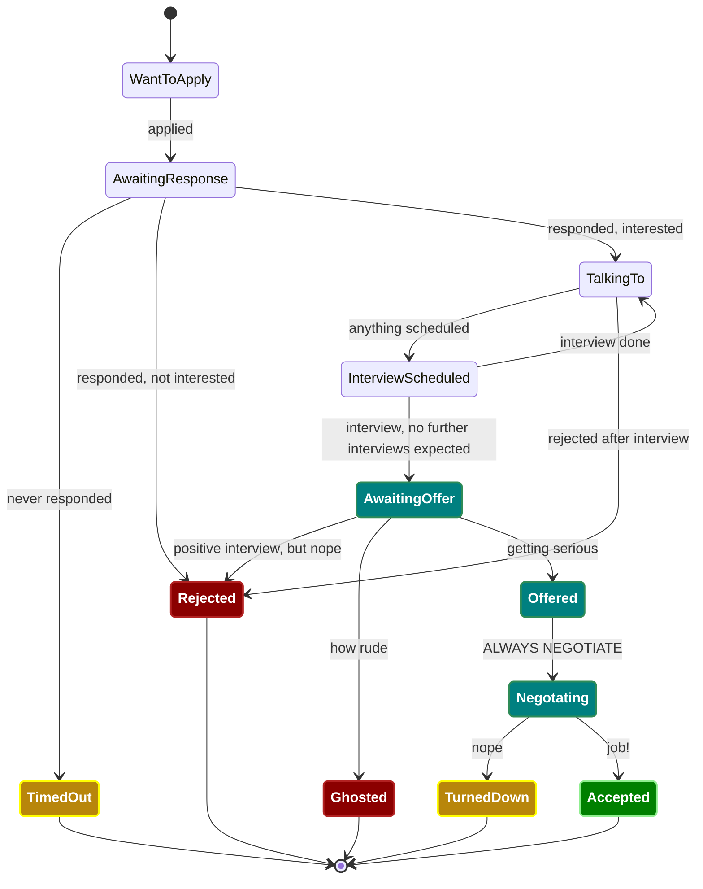

# Job Hunt Organization Tooling

Premise: Simple methodology for organizing applications during an active job hunt

Audience: Everyone, but especially recent graduates of bootcamp, undergraduate, and graduate programs who did not already accept an offer via an internship, apprenticeship, etc.

## Application Progression Diagram

