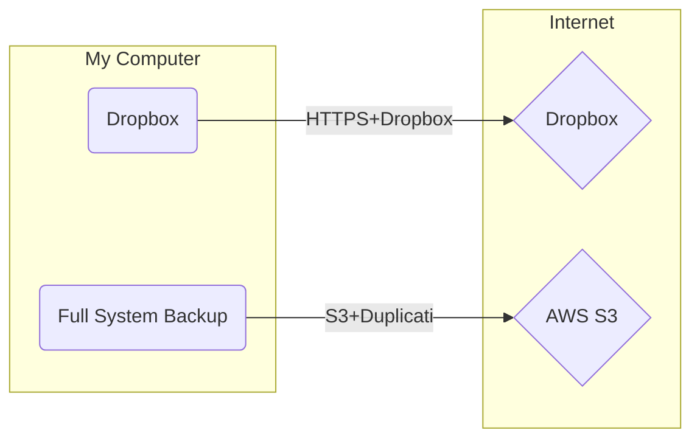

# Personal Storage Threat Modeling

Understanding where your data rests, in what state, and how it is secured.

* Walk through
  * Storage devices
    * Encryption key storage, if any
    * Purchase date
    * Warranty expiration date
    * Physical location
    * Online?
    * Internet connected?
    * Protocol for accession?
    * Credentials for accession?
  * Third-party services
    * Credentials required
    * Cost for backup and retrieval
  * Backup source and destination pairs
* Create [DAG](https://en.wikipedia.org/wiki/Directed_acyclic_graph) for credential retrieval
* Create [deployment diagram](https://plantuml.com/deployment-diagram) for backups

## See Also

* [I've locked myself out of my digital life](https://lobste.rs/s/tqull2/i_ve_locked_myself_out_my_digital_life) by Terence Eden, 2022-06-07.
    > Last night, lightning struck our house and burned it down. I escaped wearing only my nightclothes.
    > In an instant, everything was vaporised. Laptop? Cinders. Phone? Ashes. Home server? A smouldering wreck. Yubikey? A charred chunk of gristle.
    > This presents something of a problem.
    > In order to recover my digital life, I need to be able to log in to things. This means I need to know my usernames (easy) and my passwords (hard). All my passwords are stored in a Password Manager. I can remember the password to that. But logging in to the manager also requires a 2FA code. Which is generated by my phone.
    > The phone which now looks like this: 📱🔥
  * Great comments in thread
  * [When Security Locks You Out of Everything](https://www.schneier.com/blog/archives/2022/06/__trashed-2.html), Schneier's callout to it. Great comments in thread.
