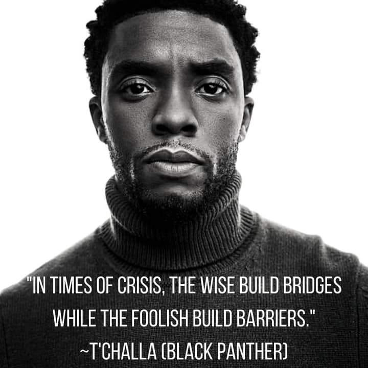

# The walls we built do not exist

## Cece n'est pas une mur

Many dogs are perfectly capable of jumping their fence, settling for protecting their territory.
Their bark is "look at me, this is my domain" or "hello", not "help me get out" most of the time.
I've seen the terror on my dog's face when she's surprised me -- and herself -- by jumping outside out of excitement.

---------

## Close calls with (non-existent) walls

We build silos, fiefdoms of responsibility withour organizations.
These walls do not exist.
We are praised for spanning teams and "thinking outside the box".
The box doesn't exist. It is a construct that was introduced for some reason that is no longer true.
It is no longer true because you're no longer respecting its existence.

---------

## Climbing walls

We create systems, cultures to help us dissolve the artificial structures our forebears constructed.
We create things like Agile, DevOps, open offices, and SRE.
We change the structures slightly, as in from QA to SWET and software reliability.

---------

## Guards and guides

We've learned that walls are bad.
But of course, _not all walls_...
Levees are pretty important and so are guard rails.
These aren't really walls, though: they're guides for unintelligent matter.

---------

## Transparency

Consider what walls do not stop.
This wall is a safety device.
It allows light through it.
Sound flows around it, albiet at a lower volume.

---------

## Failing walls

Intelligence on both sides of the wall inevitable leads to the wall failing.
See the Great Wall of China, Hadrian's Wall, Maginot Lines.
Berlin Wall.
[Trump's wall](https://www.cnn.com/2020/01/29/politics/us-border-wall-falls-over-high-winds/index.html).
Great Firewall of China. Kazakh Firewall.

---------

## ???

You cannot contain that which wants to be free.
Freedom is the default state of humanity.
Freedom is right terminable only by self-selection or due process of a society within a framework that is constantly reevaluated.

---------

##

Find the walls and tear them down.
Underserved populations.
Borders.
But respect the walls we build for ourselves in the form of agency - these guides keep less intelligent matter out of our concern.

---------

## Build Bridges

Identify the gaps in knowledge, in understanding,
and most of all, in empathy.
Create systems that enable humans to connect.
All of this technology we've built is worth less
if it does not enable us to share our happiness
and help each other as much as we are able in times of need.

---------
